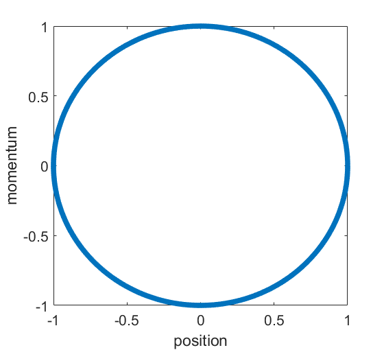

# 《分子动力学模拟》第一章：物理基础

在学习分子动力学模拟之前，需要熟悉经典力学、热力学和统计物理。本章将简要地回顾经典力学的知识并通过简谐振子开始编写一个最简单的类似于分子动力学模拟的小程序。

# Table of contents
- [牛顿力学](#牛顿力学)
 	- [质点力学](#质点力学)
 	- [粒子系力学](#粒子系力学)
 	- [牛顿运动方程的数值积分](#牛顿运动方程的数值积分)
 	- [简谐振子运动的数值求解](#简谐振子运动的数值求解)
- [分析力学](#分析力学)
  - [拉格朗日方程](#拉格朗日方程)
  - [哈密顿方程](#哈密顿方程)
  - [相空间](#相空间)
  - [哈密顿体系运动方程的数值积分](#哈密顿体系运动方程的数值积分)
- [热力学](#热力学)
 	- [基本概念](#基本概念)
 	- [热力学第一定律](#热力学第一定律)
 	- [热力学第二定律](#热力学第二定律)
  - [热力学函数和关系](#热力学函数和关系)
- [经典统计力学](#经典统计力学)
 	- [微正则系综理论](#微正则系综理论)
 	- [正则系综理论](#正则系综理论)
 	- [巨正则系综理论](#巨正则系综理论)

## 牛顿力学

### 质点力学

理论上，牛顿力学里面最基本的研究对象是质点，它是指一个有特定的质量但其大小对所研究的问题不重要的物体。有人也称它为一个粒子。这也将是分子动力学模拟中最重要的研究对象之一。 一个粒子在三维空间的运动由一个位置函数 $\vec{r}(t)$ 完全地描述。也就是说，在一个时刻 $t$ ，粒子的位置由一个有三个分量的矢量 

$$
\vec{r}(t)=x(t)\vec{e}_x + y(t) \vec{e}_y + z(t) \vec{e}_z
$$ 

给出。当然，如果不指定一个参考系，我们将无法确定这三个分量的值。参考系的数学本质是坐标系。我们说粒子的位置函数完全地描述了粒子的运动性质，是因为其它的运动性质，比如速度和加速度，都可以由位置函数导出。

速度函数定义为位置函数对时间的一阶导数：

$$
\vec{v}(t) = \frac{d \vec{r}(t)}{d t} = \dot{\vec{x}}(t)
=\frac{dx}{dt} \vec{e}_x + \frac{dy}{dt} \vec{e}_y + \frac{dz}{dt} \vec{e}_z.
$$

加速度函数定义为位置函数对时间的二阶导数，或者速度函数对时间的一阶导数：

$$
\vec{a}(t) = \frac{d ^2\vec{r}(t)}{d t^2} = \frac{d \vec{v}(t)}{d t}
= \ddot{\vec{r}}(t) = \dot{\vec{v}}(t).
$$

以上对粒子运动的描述就是所谓的运动学。下面我们讨论质点的动力学。

动力学研究物体运动及其改变的原因。牛顿运动定律让我们可以在一定的条件下确定一个粒子的位置函数 $\vec{r}(t)$。

牛顿第一定律。一个粒子在施加于它的合外力 $\vec{F}$ 为零时保持静止或者一个恒定的速度 $\vec{v}$ :

$$
\vec{F} = \vec{0} \Rightarrow  \vec{v} = \text{const}.
$$

该定律也叫惯性定律，或者惰性定律，意思是在合外力为零的情况下，一个粒子懒得改变它原来的运动状态：原来静止的话就继续静止；原来运动的话就继续原来的运动。

牛顿第二定律。一个粒子的动量 $\vec{p}$ 的时间变化率 $d\vec{p}/dt$ 正比于作用于它的合外力 $\vec{F}$：

$$
\vec{F} = \frac{d \vec{p}}{d t}.
$$

一个粒子的动量定义为其惯性质量 $m$ 与速度 $\vec{v}$ 的乘积：

$$
\vec{p}=m\vec{v}
$$

如果粒子的惯性质量是个常数的话，那么上式就变成

$$
\vec{F} = m\frac{d \vec{v}}{d t} = m \vec{a}.
$$

我们强调了这里的 $m$ 是惯性质量，原因是牛顿力学里面还有另外一个质量，叫做引力质量，虽然它们是等价的。

牛顿第三定律。每一个作用力都有一个与之大小相等、方向相反的反作用力。例如，如果有一个由粒子 2 作用在粒子 1 上的作用力  $\vec{F}_1{}_2$ ，那么一定同时存在一个由粒子 1 作用在粒子 2 上的反作用力  $\vec{F}_2{}_1$ ，它们大小相等，方向相反：

```math
\vec{F}_1{}_2 = -\vec{F}_2{}_1.
```

当然，作用力和反作用力是相对的；把一对作用力中的哪一个叫做作用力，哪一个叫做反作用力是随意的。上式表达的是牛顿第三定律的弱形式。还有一个强形式的牛顿第三定律：

$$
\vec{F}_1{}_2 \propto \vec{r}_1{}_2 \equiv \vec{r}_2 - \vec{r}_1
$$

显然，满足了牛顿第三定律的强形式，就一定满足了牛顿第三定律的弱形式，但反之不然。

我们在陈述牛顿第二定律时已经定义了动量。根据牛顿第二定律，如果作用在一个粒子上的合力为零，那么该粒子的动量将保持为一个常数：

$$
\vec{F} = \vec{0} \Rightarrow \vec{p} = \text{常数}.
$$

这就叫做动量守恒定律。

一个粒子的角动量被定义为：

$$
\vec{L} = \vec{r} \times \vec{p}.
$$

因为位置 $\vec{r}$ 依赖于坐标系原点的选取，角动量也依赖于坐标原点的选择。类似地，我们定义作用在粒子上的力矩 $\vec{\tau}$ 为：

$$
\vec{\tau} = \vec{r} \times \vec{F}.
$$

其中， $\vec{F}$ 是作用在粒子上的力。让我们来考察角动量的时间变化率：

$$
\frac{d \vec{L}}{dt} = \frac{d (\vec{r} \times \vec{p})}{dt}
= \vec{v} \times \vec{p} + \vec{r} \times \vec{F}
= \vec{r} \times \vec{F} = \vec{\tau}.
$$

这就是说，角动量的变化率等于力矩。显然，如果作用在粒子上的力矩为零，则粒子的角动量是常数：

$$
\vec{\tau} = \vec{0} \Rightarrow \vec{L} = \text{常数}.
$$

这叫做角动量守恒定律。

除了动量，还可以定义一个仅仅与质量和速度有关的物理量，叫做动能：

$$
T = \frac{1}{2}m \vec{v}^2 =
\frac{1}{2}m \vec{v} \cdot \vec{v}
= \frac{1}{2}m (v_x^2 + v_y^2 + v_z^2).
$$

在一个力 $\vec{F}$ 的作用下，如果粒子运动了一个微分位移

$$
d\vec{x} = dx \vec{e}_1 + dy \vec{e}_2 + dz \vec{e}_3
$$

那么我们定义该力对该粒子做的微功为：

$$
d W = \vec{F} \cdot d\vec{x} = F_x dx + F_y dy + F_z dz.
$$

进一步推导可得

$$
d W
= \vec{F} \cdot \vec{v} dt
= (\vec{F} dt) \cdot \vec{v}
= d\vec{p} \cdot \vec{v}
= m d\vec{v} \cdot \vec{v}
= d \left( \frac{1}{2}  m \vec{v}^2 \right)
= dT.
$$

所以，在一个过程中，外力对一个粒子做的功等于粒子动能的改变量。

外力 $\vec{F}$ 做的功一般来说依赖于路径的选取。然而，如果外力做的功与具体的路径无关，而只与起点和终点有关，那么由矢量分析的定理可知，该外力可以写成一个标量场 $U(\vec{r})$ 的梯度的负值：

$$
\vec{F} = -\nabla U(\vec{r}).
$$

该标量场 $U(\vec{r})$ 叫做粒子的势能场，简称为势能，或者进一步简称为势。与此对应的力称为保守力。该保守力沿任意微小路径对粒子做的总功为：

$$
dW = - \nabla U(\vec{r}) \cdot d\vec{r} = - dU.
$$

将该式与前面得到的 $dW = dT$ 比较可得：

$$
dT + dU = 0.
$$

这就是说，在一个保守力的作用下，任意过程中粒子的动能与势能的和都不改变。这个不改变的量称为机械能。所以，在保守力的作用下，粒子的机械能是守恒的。

### 粒子系力学

在具体讨论粒子系的动力学行为之前必须先弄清楚内力和外力的区别。内力是系统中某个粒子作用于另一个粒子的，而外力来自于系统之外。内力满足牛顿第三定律。虽然外界施与粒子 $i$ 一个力 $\vec{F}^{\text{ext}}_{i}$ 的同时，粒子 $i$ 同时也施与外界一个大小相等、方向相反的反作用力，但由于我们的系统不包含外界，我们通常不会对外力利用第三定律。以上就是内力与外力的区别。

对任意一个粒子 $i$，我们可以写下它的动力学方程：

$$
m_i \ddot{\vec{r}}_i = \sum _{{ j \neq i }} \vec{F}_i{}_j + \vec{F}^{\text{ext}}_i.
$$

将上式左右两边都对指标 $i$ 求和，得

$$
\sum_i m_i \ddot{\vec{r}}_i = \sum_i \sum _{{j \neq i}} \vec{F}_i{}_j + \sum_i \vec{F} ^{\text{ext}} _i.
$$

根据牛顿第三定律，等号右边的第一项等于零。系统的总质量定义为 $m = \sum_i m_i$。如果定义一个平均坐标

$$
\vec{r} = \frac{\sum_i m_i \vec{r}_i}{m},
$$

那么我们有

$$
m \ddot{\vec{r}} = \sum_i \vec{F}^{\text{ext}}_{i}.
$$

这个式子看上去很像一个质量为系统总质量 $m$，坐标为平均坐标 $\vec{x}$ 的粒子的动力学方程；该粒子所受的合外力为整个粒子系所受的合外力。我们称这个等效的粒子为粒子系的质心。质心的质量就是整个系统的质量；质心坐标就是上述平均坐标；质心的运动满足上述等效的牛顿第二定律。

由质心坐标可以定义质心速度

$$
\dot{\vec{r}} = \frac{\sum_i m_i \dot{\vec{r}}_i}{m}
$$

和质心动量

$$
\vec{p} = m \dot{\vec{r}} = \sum_i m_i \dot{\vec{r}}_i.
$$

于是，质心的牛顿第二定律可用质心动量表达为：

$$
\frac{d \vec{p}}{dt} = \sum_i \vec{F}^{\text{ext}}_{i}.
$$

如果系统受到的合外力为零，那么系统的质心动量（即系统的总动量）是守恒的。这就是质点系的动量守恒定律。

类似地，由牛顿第三定律可以证明内力对系统的总力矩的贡献也是零，即系统所受的总力矩等于外力的总力矩 $\vec{\tau}^{\text{ext}}$：

$$
\vec{\tau}^{\text{ext}} = \sum_i^N \vec{r}_i \times \vec{F}_i^{\text{ext}}.
$$

如果定义系统的总角动量为

$$
\vec{L} = \sum_i^N \vec{L}_i = \sum_i^N \vec{r}_i \times \vec{p}_i,
$$

那么可以证明如下的角动量定理：

$$
\frac{d \vec{L}}{dt} = \vec{\tau}^{\text{ext}}.
$$

这就是说，外力产生的总力矩等于系统总角动量的时间变化率。如果外力产生的总力矩等于零，则有系统的总角动量守恒。这就是质点系的角动量守恒定理。

对于有相互作用的多粒子系统，如果内力和外力都是保守力，那么系统的总势能可以表达为

$$
U = \sum_i U_i + \frac{1}{2} \sum_i^N \sum_{j\neq i}^N U_i{}_j,
$$

其中， $U_i$ 是第 $i$ 个粒子在外力场中的势能， $U_i{}_j$ 是系统中由 $i$ 与 $j$ 的相互作用导致的势能。


### 牛顿运动方程的数值积分

给定一个多粒子体系的初始状态（坐标和速度），根据各个粒子之间的相互作用力就可以预测该体系的运动状态，即任意时刻各个粒子的坐标和速度。该预测过程本质上就是对运动方程的数值积分。

我们对粒子 $i$ 在 $t+\Delta t$ 时刻的坐标做泰勒级数展开：

$$
\vec{r}_i(t+\Delta t) \approx \vec{r}_i(t) + \vec{v}_i(t) \Delta t + \frac{1}{2} \frac{\vec{F}_i(t)}{m_i} \Delta t^2.
$$

我们也可考虑一个过去的时刻 $t-\Delta t$ 并做类似的展开

$$
\vec{r}_i(t-\Delta t) \approx \vec{r}_i(t) - \vec{v}_i(t) \Delta t + \frac{1}{2} \frac{\vec{F}_i(t)}{m_i} \Delta t^2.
$$

由以上两式可得

$$
\vec{r}_i(t+\Delta t) \approx 2\vec{r}_i(t) - \vec{r}_i(t-\Delta t) + \frac{\vec{F}_i(t)}{m_i} \Delta t^2.
$$

这就是所谓的 [Verlet积分算法](https://doi.org/10.1103/PhysRev.159.98)，它只涉及坐标，不涉及速度。如果要获得速度，需要通过如下差分求得：

$$
\vec{v}_i(t) \approx \frac{ \vec{r}_i(t+\Delta t) - \vec{r}_i(t-\Delta t) }{2\Delta t}.
$$

Verlet积分算法中的速度计算涉及到时间上相差 $2\Delta t$ 的坐标，不是很方便。为了得到更加方便的速度计算方式，我们考虑如下两个展开：

$$
\vec{r}_i(t+\Delta t) \approx \vec{r}_i(t) + \vec{v}_i(t) \Delta t + \frac{1}{2} \frac{\vec{F}_i(t)}{m_i} \Delta t^2.
$$

$$
\vec{r}_i(t) \approx \vec{r}_i(t+\Delta t) - \vec{v}_i(t+\Delta t) \Delta t + \frac{1}{2} \frac{\vec{F}_i(t+\Delta t)}{m_i} \Delta t^2.
$$

由此可得到如下速度计算公式：

$$
\vec{v}_i(t+\Delta t) \approx \vec{v}_i(t) + \Delta t \frac{ \vec{F}_i(t) + \vec{F}_i(t+\Delta t) }{2m_i}.
$$

以上就是 [速度-Verlet 积分算法](https://doi.org/10.1063/1.442716)。

可以看出， $t+\Delta t$ 时刻的坐标仅依赖于 $t$ 时刻的坐标、速度和力，但 $t+\Delta t$ 时刻的速度依赖于 $t$ 时刻的速度、力及 $t+\Delta t$ 时刻的力。所以，从算法的角度来说，速度-Verlet 积分算法对应如下的计算流程：

第一步：部分地更新速度并完全地更新坐标（注意，我们引入了一个中间的速度变量 $\vec{v}_i(t+\Delta t/2)$）：

$$
\vec{v}_i(t) \rightarrow \vec{v}_i(t+\Delta t/2)=\vec{v}_i(t)+\frac{1}{2}\frac{\vec{F}_i(t)}{m_i}\Delta t
$$

$$
\vec{r}_i(t)\rightarrow \vec{r}_i(t+\Delta t)
=\vec{r}_i(t)
+\vec{v}_i(t+\Delta t/2)\Delta t
$$

第二步：用更新后的坐标计算新的力

$$
\vec{F}_i(t)\rightarrow \vec{F}_i(t+\Delta t)
$$

第三步：用更新后的力完成速度的更新：

$$
\vec{v}_i(t+\Delta t/2) \rightarrow \vec{v}_i(t+\Delta t)=\vec{v}_i(t+\Delta t/2)+\frac{1}{2}\frac{\vec{F}_i(t+\Delta t)}{m_i}\Delta t
$$

### 简谐振子运动的数值求解

我们用一个简谐振子模型来展示速度-Verlet算法的实现。简谐振子偏离平衡位置的坐标为 $x$ ， 受力为 $-kx$ ， $k$ 是弹簧的劲度系数。

Matlab 代码如下：
```matlab
m=1; k=1; dt=0.01; n_step=1000;
v=0; x=1; 
v_vector=zeros(n_step,1); x_vector=zeros(n_step,1);
for step=1:n_step
    v=v-(dt/2)*k*x; 
    x=x+dt*v;
    v=v-(dt/2)*k*x; 
    v_vector(step,:)=v; x_vector(step,:)=x;
end
```

下面是坐标和速度随时间变化的图：


## 分析力学

### 拉格朗日方程

我们知道，一个由 $N$ 个质点构成的力学系统需要用 $3N$ 个坐标分量及其相应的速度分量来描述其运动状态。我们说，该系统的力学自由度为 $3N$。 但如果是一个由这 $N$ 个质点构成的刚体，则自由度只有 6：3 个平动自由度和 3 个转动自由度。刚体的自由度之所以小于自由质点系统的自由度，是因为刚体系统中有约束。

约束的分类很复杂，但我们只关注最简单的一种：稳定的几何约束。一个原本有 $M$ 个自由度的体系，若受到 $m$ 个几何约束，则其自由度为 $s=M-m$。要描述该体系，我们不一定需要使用原来的 $M$ 个坐标和速度，而可以构造 $s$ 个新的坐标和速度。这 $s$ 个新的坐标不一定限于在原来的 $M$ 个老坐标中挑选，而完全可以另行选取。这样选取的新坐标叫做广义坐标。广义坐标不一定能三个一组地构成矢量，而且某个广义坐标也不一定具有长度的量纲。相应地，某个广义速度也不一定具有速度的量纲。

将 $s$ 个广义坐标 $q_1, q_2, \cdots q_s$ 的集合简记为 $q$。对于保守力体系，可以从牛顿力学出发推导出如下拉格朗日方程：

$$
\frac{d}{dt}
\left(\frac{\partial (T-U)}{\partial \dot{q}_{\alpha}}\right)
-\frac{\partial (T-U)}{\partial q _{\alpha} } = 0.
\quad (\alpha = 1, 2, \cdots, s)
$$

这里出现的动能与势能的差是一个很重要的量，叫做拉格朗日量，记为

$$
L(q, \dot{q}) = T(\dot{q}) - U(q).
$$

用拉格朗日量可以将拉格朗日方程写成更加简洁的形式：

$$
\boxed{
\frac{d}{dt}
\left(\frac{\partial L}{\partial \dot{q} _{\alpha} }\right)
-\frac{\partial L}{\partial q _{\alpha} } = 0.
\quad (\alpha = 1, 2, \cdots, s)
}
$$

例子：简谐振子的拉格朗日量为

$$
L = \frac{1}{2} m \dot{x}^2 - \frac{1}{2} k x^2
$$

由此可以推导出简谐振子的运动方程

$$
m \ddot{x} + k x = 0.
$$


### 哈密顿方程

由于拉格朗日量具有能量的量纲，故当广义坐标具有长度的量纲时，偏导数 $\frac{\partial L}{\partial \dot{q}_{\alpha}}$ 具有动量的量纲。我们称这个偏导数为广义动量，记为

$$
\boxed{p_{\alpha} = \frac{\partial L}{\partial \dot{q}_{\alpha}}}.
$$

注意，当广义坐标不具有长度的量纲时，相应的广义动量也不具有动量的量纲。运用广义动量可以将拉格朗日方程写成更加简洁的形式：

$$
\boxed{
\dot{p} _{\alpha}
-\frac{\partial L}{\partial q _{\alpha} } = 0.
\quad (\alpha = 1, 2, \cdots, s)
}
$$

虽然广义动量出现在拉格朗日方程中，但我们要清楚的是拉格朗日量是广义坐标和广义速度的函数，而不是广义动量的函数。用勒让德变换可以改变一个多元函数的独立变量。为此，我们先写下拉格朗日量的全微分：

$$
d L(q, \dot{q}) = \frac{\partial L}{\partial q _{\alpha} } d q _{\alpha}  + \frac{\partial L}{\partial \dot{q} _{\alpha} } d \dot{q} _{\alpha} = \dot{p} _{\alpha} d q _{\alpha} + p _{\alpha} d \dot{q} _{\alpha}.
$$

勒让德变换能将独立变量从广义速度变成广义动量。勒让德变换是指将函数减去它的某个独立变量与它对该独立变量的偏导数的乘积。选取广义速度为该独立变量，并将变换后的函数取一个相反数，则有如下勒让德变换

$$
L \rightarrow p_{\alpha} \dot{q}_{\alpha} - L.
$$

变换后的函数

$$
H = p_{\alpha} \dot{q}_{\alpha} - L.
$$

称为哈密顿量，它的全微分为：

$$
d H = p _{\alpha} d\dot{q} _{\alpha} + \dot{q} _{\alpha} d p _{\alpha} - (\dot{p} _{\alpha} d q _{\alpha} + p _{\alpha} d \dot{q} _{\alpha}) =\dot{q} _{\alpha} d p _{\alpha} - \dot{p} _{\alpha} d q _{\alpha}.
$$

看来哈密顿量确实是广义动量以及广义坐标的函数，而不是广义速度的函数了。

既然哈密顿量是广义动量和广义坐标的函数，那么根据全微分的定义，我们又有

$$
d H = \frac{\partial H}{\partial q _{\alpha}} d q _{\alpha} + \frac{\partial H}{\partial p _{\alpha} } d p _{\alpha}.
$$

对比以上两个式子，我们得到如下两组重要的方程：

$$
\dot{q} _{\alpha} = \frac{\partial H}{\partial p _{\alpha}}, \quad (\alpha = 1 , 2, \cdots, s)
$$

$$
\dot{p} _{\alpha} = - \frac{\partial H}{\partial q _{\alpha}}. \quad (\alpha = 1 , 2, \cdots, s)
$$

这 $2s$ 个一阶微分方程组称为哈密顿正则方程。这里的“正则”意为“简单且对称”。

对于由 $N$ 个粒子组成的体系，根据上述哈密顿量的定义可知：

$$
H = \sum_i \frac{\vec{p}_i^2}{2m_i} + U(\vec{r}_1, \vec{r}_2, \cdots, \vec{r}_N)
$$

由此可见，哈密顿就是体系的总能量。

例子：简谐振子的哈密顿量为

$$
H = \frac{p^2}{2m} + \frac{1}{2} k x^2.
$$

由此可得运动方程为：

$$
\dot{x} = \frac{p}{m}
$$

$$
\dot{p} = - k x.
$$

这都和牛顿力学的结果是一致的。

### 相空间

广义坐标和广义动量是相互独立的变量。我们可以将 $s$ 个广义坐标看成一个 $2s$ 维“空间”的“坐标”。这个抽象的“空间”叫做相空间。一组给定的广义坐标和广义动量叫做相空间的一个相点。另外，根据哈密顿正则方程，只要给定一个初始条件，即初始时刻的各个广义坐标和广义动量，就可以唯一地确定任意时刻的各个广义坐标和广义动量，即如下 $2s$ 个函数：

$$
q _{\alpha} = q _{\alpha}(t), \quad p _{\alpha} = p _{\alpha}(t). \quad (\alpha = 1, 2, \cdots, s)
$$

这 $2s$ 个函数将在 $2s$ 维的相空间给出一条轨迹，叫做相轨迹。随着时间的推移，一条相轨迹会在相空间跑动，历经很多不同的相点。一个系统中不同的初始条件会给出不同的相轨迹，而两条不同的相轨迹绝对不会相交于某一个相点。

例子：简谐振子的相空间。



对于哈密顿体系，我们还可以证明，相空间是不可压缩的。为此，我们先将广义坐标和动量简写为如下的 $2s$ 分量的矢量：

$$
x \equiv (q_1, q_2, \cdots, q_s, p_1, p_2, \cdots, p_s).
$$

这个矢量就代表一个相空间点，它代表相空间的“坐标”。 根据哈密顿正则方程，该相空间“坐标”的速度为

$$
\dot{x} = \left(\frac{\partial H}{\partial p_1}, \frac{\partial H}{\partial p_2}, \cdots, 
\frac{\partial H}{\partial p_s}, -\frac{\partial H}{\partial q_1}, -\frac{\partial H}{\partial q_2}, \cdots, -\frac{\partial H}{\partial q_s}\right).
$$

在流体力学中，流体的不可压缩性指的是其中的流速场的散度为零（即没有源和汇）。将相空间类比为流体，那么相空间的不可压缩性指的是：

$$
\nabla_{x} \cdot \dot{x} = 0.
$$

这是很显然的：

$$
\nabla_{x} \cdot \dot{x} =
\sum_{\alpha} \frac{\partial^2 H}{\partial p_{\alpha} \partial q_{\alpha}} -
\frac{\partial^2 H}{\partial q_{\alpha} \partial p_{\alpha}} = 0.
$$

所以，哈密顿体系的相空间是不可压缩的。


哈密顿体系相空间的不可压缩性也意味着刘伟尔定理。首先定义相空间的体积元：

$$
d x = dx_1  dx_2 \cdots dx_{2s}
$$

记某个初始时刻 $t=0$ 的相空间点为 $x_0$，时刻 $t$ 的相空间点为 $x_t$， 刘伟尔定理是说

$$
d x_t = dx_0
$$

即相空间的体积元的体积是守恒的。 

为了证明该等式，我们首先注意到，两个体积元可由一个雅可比行列式联系：

$$
d x_t = \det(J) dx_0
$$

为了确定雅可比行列式，我们先计算它的时间导数：

$$
\frac{d }{dt} \det(J) = \frac{d}{dt} e^{\mathrm{Tr}[\ln (J)]}
 = \det(J)  \mathrm{Tr}[ \frac{dJ}{dt} J^{-1}]
$$

上面利用了等式

$$
\det(J) = e^{\mathrm{Tr}[\ln (J)]}
$$

将求迹展开得

$$
\frac{d \det(J)}{dt} 
= \det(J)  \sum_{k,l} \frac{\partial \dot{x}_t^k}{\partial x_0^l} \frac{\partial x_0^l}{\partial x_t^k}
$$

利用求导的链式法则得

$$
\frac{d \det(J)}{dt} 
= \det(J)  \sum_{k} \frac{\partial \dot{x}_t^k}{\partial x_t^k} 
$$

根据相空间体积的不可压缩性

$$
\sum_{k} \frac{\partial \dot{x}_t^k}{\partial x_t^k} = 0 
$$ 

可知

$$
\frac{d \det(J)}{dt} = 0.
$$

也就是说，雅可比行列式不随时间变化。将时刻 $t$ 取 0 可知它是个常数：

$$
\det(J) = 1
$$

于是，我们就证明了刘伟尔定理：

$$
d x_t = dx_0
$$

### 哈密顿体系运动方程的数值积分

一个一般的物理量可以表达为相空间坐标的函数

$$
A=A(q_{\alpha}, p_{\alpha})
$$

我们求它的时间导数

$$
\frac{dA}{dt}= \sum_{\alpha} \left( \frac{\partial A}{\partial q _{\alpha} } \dot{q} _{\alpha} 
+\frac{\partial A}{\partial p _{\alpha} } \dot{p} _{\alpha} \right)
$$

利用哈密顿正则方程，可得

$$
\frac{dA}{dt}= \sum_{\alpha} \left( \frac{\partial A}{\partial q _{\alpha} } 
\frac{\partial H}{\partial p _{\alpha} }
-\frac{\partial A}{\partial p _{\alpha} } 
\frac{\partial H}{\partial q _{\alpha} } \right)
$$

定义任意两个物理量之间的泊松括号

$$
\lbrace A,B \rbrace = \sum_{\alpha} \left( \frac{\partial A}{\partial q _{\alpha} } 
\frac{\partial B}{\partial p _{\alpha} }
-\frac{\partial A}{\partial p _{\alpha} } 
\frac{\partial B}{\partial q _{\alpha} } \right)
$$

我们有

$$
\frac{dA}{dt}= \lbrace A,H \rbrace.
$$

如果将物理量 $A$ 取为哈密顿量本身，则有

$$
\frac{dH}{dt} = \lbrace H,H \rbrace = 0.
$$

由此可见，由哈密顿描述的力学体系的能量是守恒的。

一个物理量 $A$ 和哈密顿量之间的泊松括号运算也常用刘维尔算符表示

$$
\frac{dA}{dt} = \lbrace A,H \rbrace \equiv iLA
$$

该方程的形式解为

$$
A(t)=e^{iLt}A(t=0)
$$

可以证明，刘维尔算符是厄米算符，故上述指数算符是幺正算符，称为经典演化算符（学过量子力学的读者会发现该指数算符和量子演化算符类似）。

将物理量 $A$ 取为相空间坐标，则有

$$
x_t = e^{iLt} x_0
$$

该式只是形式解；我们通常是无法解析求解经典演化算符的。这也就是要研究近似的数值计算方法的根本原因所在。

为了推导近似的计算方法，我们首先注意到，可将刘维尔算符写成：


$$
iL = \sum_{\alpha} \left( \frac{\partial }{\partial q _{\alpha} } 
\frac{\partial H}{\partial p _{\alpha} }
-\frac{\partial }{\partial p _{\alpha} } 
\frac{\partial H}{\partial q _{\alpha} } \right)
$$

我们先将其写成两部分的和：

$$
iL = iL_1 + iL_2
$$

$$
iL_1 = \sum_{\alpha} 
\left( 
\frac{\partial }{\partial q _{\alpha} } 
\frac{\partial H}{\partial p _{\alpha} } 
\right)
$$

$$
iL_2 = \sum_{\alpha} 
\left( 
-\frac{\partial }{\partial p _{\alpha} } 
\frac{\partial H}{\partial q _{\alpha} } 
\right)
$$

以上两个刘维尔算符是非对易的，即

$$
iL_1 iL_2 - iL_2 iL_1 \equiv [iL_1, iL_2] \neq 0
$$

这可由一维简谐振子很容易地验证。

因为以上两个刘维尔算符不对易，我们就不能将经典演化算符分开，即：

$$
e^{iL_1t + iL_2t} \neq e^{iL_1t} e^{iL_2t}
$$

实际上，两个部分的时间演化算符 $e^{iL_1t}$ 和 $e^{iL_2t}$ 都是可精确求解的。那么我就希望找到一种方法，使得可以用 $e^{iL_1t}$ 和 $e^{iL_2t}$ 近似地表达 $e^{iL_1t + iL_2t}$ 。对称 Trotter 定理（引用）提供了一种近似方法：

$$
e^{A + B} = \lim_{P \to \infty} \left[ e^{B/2P} e^{A/P} e^{B/2P} \right]^P
$$

利用该定理，我们有

$$
e^{iLt} = \lim_{P \to \infty} \left[ e^{iL_2t/2P} e^{iL_1t/P} e^{iL_2t/2P} \right]^P
$$

根据该式，我们定义一个时间步长  

$$
\Delta t = t / P
$$

于是，经典演化算符可以近似地表达为

$$
e^{iLt} \approx \left[ e^{iL_2 \Delta t/2} e^{iL_1 \Delta t} e^{iL_2 \Delta t/2} \right]^P + \mathcal{O}(P\Delta t^3)
$$

上式的最后一项说明该近似的（整体）误差正比于 $P\Delta t^3$ ，也就是 $\Delta t^2$ 。

如果只看一个时间步的话

$$
e^{iL \Delta t} \approx e^{iL_2 \Delta t/2} e^{iL_1 \Delta t} e^{iL_2 \Delta t/2}  + \mathcal{O}(\Delta t^3)
$$

上式的最后一项说明该近似在一个步长内的（局部）误差正比于 $\Delta t^3$ 。

下面考虑 $N$ 个质点的体系。该体系的相空间坐标从时刻 $t$ 到时刻 $t+\Delta$ 的演化可以表达为

$$
\left(
\begin{array}{c}
\vec{r}_i(t+\Delta t) \\
\vec{p}_i(t+\Delta t)
\end{array}
\right) =
e^{iL\Delta t}
\left(
\begin{array}{c}
\vec{r}_i(t) \\
\vec{p}_i(t)
\end{array}
\right),
$$

利用 Trotter 定理可得

$$
\left(
\begin{array}{c}
\vec{r}_i(t+\Delta t) \\
\vec{p}_i(t+\Delta t)
\end{array}
\right) \approx
e^{iL_2 \Delta t/2} e^{iL_1 \Delta t}e^{iL_2 \Delta t/2}
\left(
\begin{array}{c}
\vec{r}_i(t) \\
\vec{p}_i(t)
\end{array}
\right).
$$

因为

$$
\frac{\partial H}{\partial \vec{p}_i} =
\frac{\vec{p}_i}{m_i} ~ \text{and} ~
-\frac{\partial H}{\partial \vec{r}_i} =
\vec{F}_i,
$$

故上述时间演化中两部分的刘维尔算符分别为：

$$
iL_1 = \sum_{i=1}^N
\frac{\vec{p}_i}{m_i} \cdot
\frac{\partial }{\partial \vec{r}_i},
$$

$$
iL_2 = \sum_{i=1}^N
\vec{F}_i \cdot
\frac{\partial }{\partial \vec{p}_i}.
$$

为了进一步推导，我们注意到，对于任意的常数 $c$ ， 我们有

$$
e^{c \frac{\partial}{\partial x}} x = x+c.
$$

将该式应用到最右边的演化算符 $e^{iL_2 \Delta t/2}$ 可得

$$
\left(
\begin{array}{c}
\vec{r}_i(t+\Delta t) \\
\vec{p}_i(t+\Delta t)
\end{array}
\right) \approx
e^{iL_2 \Delta t/2} e^{iL_1 \Delta t}
\left(
\begin{array}{c}
\vec{r}_i(t) \\
\vec{p}_i(t) + \frac{\Delta t}{2} \vec{F}_i(t)
\end{array}
\right).
$$

再考虑算符 $e^{iL_1 \Delta t}$ ，可得

$$
\left(
\begin{array}{c}
\vec{r}_i(t+\Delta t) \\
\vec{p}_i(t+\Delta t)
\end{array}
\right) \approx
e^{iL_2 \Delta t/2}
\left(
\begin{array}{c}
\vec{r}_i(t) + \Delta t \frac{\vec{p}_i(t) + \frac{\Delta t}{2} \vec{F}_i(t)}{m_i} \\
\vec{p}_i(t) + \frac{\Delta t}{2} \vec{F}_i(t)
\end{array}
\right).
$$

再考虑算符 $e^{iL_2 \Delta t/2}$ ，可得

$$
\left(
\begin{array}{c}
\vec{r}_i(t+\Delta t) \\
\vec{p}_i(t+\Delta t)
\end{array}
\right) \approx
\left(
\begin{array}{c}
\vec{r}_i(t) + \Delta t \frac{\vec{p}_i(t) + \frac{\Delta t}{2} \vec{F}_i(t)}{m_i} \\
\vec{p}_i(t) +
\frac{\Delta t}{2} \vec{F}_i(t) +
\frac{\Delta t}{2} \vec{F}_i(t+\Delta t)
\end{array}
\right).
$$

上式可由坐标和速度表达为：

$$
\vec{r}_i(t+\Delta t) \approx \vec{r}_i(t) + \vec{v}_i(t) \Delta t + \frac{1}{2} \frac{\vec{F}_i(t)}{m_i} \Delta t^2.
$$

$$
\vec{v}_i(t+\Delta t) \approx \vec{v}_i(t) + \Delta t \frac{ \vec{F}_i(t) + \vec{F}_i(t+\Delta t) }{2m_i}.
$$

这就是速度-Verlet 积分公式。所以，我们从经典演化算符和 Trotter 定理推导出了速度-Verlet 积分公式。


## 热力学

### 基本概念

一个热力学系统是大量粒子的集合，常简称为系统。系统之外的所有物质称为环境。

如果系统与环境既不能交换能量也不能交换物质，则称其为一个孤立系统；若可交换能量但不能交换物质，则称为闭合系统；若即可交换能量也可交换物质，则称为开放系统。交换的能量可以是热能，称为热量，也可以是机械能，称为功。

如果我们说一个系统达到了热力学平衡，那么它的各个部分 (叫做子系统) 之间一定同时达到了热平衡、力学平衡和扩散平衡。

热力学中一共有四条基本经验定律，其中在时间上最后提出但在逻辑上排在第一个的叫热力学第零定律。该定律说如果两个系统分别与第三个系统能达到热平衡，那么这两个系统也一定能达到热平衡。这说明处于热平衡的两个系统之间有一个相等的量。这个量就是热力学中最重要的物理量之一：温度。这就是温度的定义之一。

通过规定两个特定系统的温度值，可以建立温标。一般选择一个大气压下水的冰点和沸点作为这两个特定系统。以下是两个常用温标：

（1）摄氏 (Celsius) 温标规定冰点的温度为 0 摄氏度，沸点的温度为 100 摄氏度，而且将这中间的温度均分为 100 份。这是我们生活中常用的温标。

（2）开尔文 (Kelvin) 温标规定冰点的温度为 273.15 K，沸点的温度为 373.15 K，而且将这中间的温度均分为 100 份。这是本书后面使用的温标。

考虑一个简单的孤立或者闭合系统，达到热力学平衡时，可由三个物理量描述。它们是：压强 $p$、体积 $V$ 和温度 $T$。给定这三个量，就确定了系统的一个状态。事实上，这三个量并非完全独立，而是由状态方程联系着的。该方程可写为

$$
f(p, V, T) = 0.
$$

其中， $f$ 是一个特定的三元函数。我们可以将其中任何一个量写成另外两个量的两元函数，比如 $V=V(p,T)$。这样的两元函数在由 $p$、 $V$、 $T$ 这三个参数构成的三维空间中可以表示为一个曲面。系统的某一个状态就对应于该曲面上的一个点。

如果系统的状态发生了变化，我们称系统经历了一个过程。如果系统在其状态发生变化时始终无限接近平衡态，那么系统经历的过程为准静态过程。显然，准静态过程对应于状态方程曲面上的一条曲线。

理想气体是严格满足如下定律的系统：
（1）玻意耳-马略特 (Boyle-Mariotte) 定律：等温时压强反比于体积。
（2）查理 (Charles) 定律：等容时压强正比于温度。
（3）盖吕萨克 (Gay-Lussac) 定律：等压时体积正比于温度。

通过这些定律以及标准状态 (压强为一个大气压，温度为 0 摄氏度) 下的摩尔体积 (约 $22.4 \times 10^{-3}$ m$^3$ /mol) 可以定出理想气体的状态方程：

$$
pV = \nu R T.
$$

这里， $\nu$ 是物质的量， $R \approx 8.31$ J/mol/K 是理想气体普适常量。它与玻尔兹曼 (Boltzmann) 常量 $k_B \approx 1.38\times 10^{-23}$ J/K 由下式联系：

$$
R \equiv N_A k_B.
$$

这里， $N_A \approx 6.02\times 10^{23}$ /mol 是阿伏伽德罗 (Avogadro) 常量。注意到 $\nu N_A =N$ 就是系统的粒子数，我们可将理想气体的状态方程改写成

$$
p V = N k_B T.
$$

再定义

$$
n=N/V
$$

为系统的数密度，我们又可以将理想气体的状态方程改写成

$$
p = n k_B T.
$$

对于单原子理想气体，可以证明：

$$
p = \frac{1}{3}n m \langle\vec{v}^2\rangle.
$$

其中， $m$ 是一个原子的质量， $\langle\vec{v}^2\rangle$ 是原子速度平方的平均值。于是，我们有

$$
\frac{3}{2}k_BT = \frac{1}{2} m \langle\vec{v}^2\rangle.
$$

这就是温度的微观意义之一：温度是原子平均平动动能的量度。

### 热力学第一定律

热力学第一定律是说，在一个过程中，如果环境对系统做了功，也传了热，那么系统的内能的增加量 $\Delta E$ 就等于环境对系统做的功 $W$ 和传给系统的热 $Q$ 的和：

$$
\Delta E = Q + W.
$$

如果系统对环境做功，则约定 $W<0$ ；如果系统传给环境热量，则约定 $Q<0$ 。这个定律是能量守恒定律在热力学系统中的应用。

如果考虑的是无限小过程，那么可以将热力学第一定律写成

$$
d E = \delta Q + \delta W.
$$

功和热量都不是状态量，而是过程量，即它们依赖于具体的过程。或者说，功和热量不能描述系统的状态。这点与内能不同。从数学的角度来说，状态量的微分是恰当微分，而过程量的微分则不是。所以，为了区分，我们用 $dE$ 表示内能的微分，而用 $\delta W$ 和 $\delta Q$ 表示微小的功和热量。

系统在吸热时温度一般会升高 (有反例)。因为热量与过程有关，所以将一个系统的温度升高一定的值所需要的热量依赖于系统所经历的过程。指定一个过程，就可以定义一个叫做热容的物理量：

$$
C = \frac{\delta Q}{d T}.
$$

常见的两个过程是等容过程和等压过程，对应的热容分别为等容热容和等压热容。

如果体积固定，系统与外界互不做功，热力学第一定律告诉我们 $\delta Q = d E$ 。从而，等容热容可表达为

$$
C_V =\left(\frac{~\delta Q}{dT}\right)_V
= \left(\frac{\partial E}{\partial T}\right)_V.
$$

如果压强固定 (但体积不固定)，系统要对环境做功 $pdV$ ，此时热力学第一定律告诉我们 $\delta Q = d E + p d V = d (E + p V)$ 。从而，等压热容可表达为

$$
C_p = \left(\frac{~\delta Q}{dT}\right)_p = \left(\frac{\partial H}{\partial T}\right)_p.
$$

其中，我定义了一个新的类似于内能的热力学函数，焓：

$$
H = E + p V.
$$

综上可知：等容过程中系统吸收的热量等于其内能的增加量；等压过程中系统吸收的热量等于其焓的增加量。

若是一个过程中，系统与环境没有热交换，那么该过程叫做绝热过程。对理想气体来说，容易证明，绝热过程可以由下式描述：

$$
p V^{\gamma} = \text{constant}.
$$

其中，

$$
\gamma \equiv \frac{C_p}{C_V}.
$$

是等压热容和等容热容的比值，叫做绝热指数。

循环过程是系统终态等于初态的过程。在 $p-V$ 图中，循环过程对应于一个闭合路径。若闭合路径为顺时针方向，则系统对环境做净功并从环境中吸净热，对应于热机；反之，环境对系统做净功并从系统中吸净热，对应于制冷机。

理论上最重要的循环过程为理想气体的卡诺 (Carnot) 循环，包含等温膨胀（高温  $T_{1}$）、绝热膨胀、等温压缩（低温 $T_{2}$）、绝热压缩四个过程。高温和低温由环境中的热浴来保持。根据热力学第一定律，对于卡诺热机，系统将在等温膨胀过程中从温度为 $T_{1}$ 的高温热源吸热，并在等温压缩过程中向温度为 $T_{2}$ 的低温热源放热。计系统吸入和放出的热量为 $Q_{1}$ 和 $|Q_{2}|$ ( $Q_{2} < 0$ )，并定义热机的效率 $\eta$ 为系统所做净功与从高温热源所吸热量的比值：

$$
\eta = \frac{ Q_{1} - |Q_{2}| } { Q_{1} }.
$$

很容易证明，这个效率其实只与温度有关而且总小于 1：

$$
\eta = \frac{ T_{1} - T_{2} } { T_{1} }
= 1- \frac{ T_{2} } { T_{1} }.
$$

为什么热机的效率总小于1呢？即：为什么系统不能把吸收的热量全部转化为功呢？这是热力学第一定律回答不了的问题。要回答这个问题，我们需要学习热力学第二定律。

### 热力学第二定律

比较上面关于卡诺热机效率的两个公式可知 (注意 $Q_2<0$ )

$$
\frac{Q_1}{T_1} + \frac{Q_2}{T_2} = 0.
$$

该式用微积分的语言可以写成

$$
\oint \frac{~d Q}{T} = 0.
$$

克劳修斯证明了该式不光对卡诺循环成立，而且对任何可逆循环过程都成立。如果该式不成立，对应的循环就是不可逆的。对不可逆循环，克劳修斯证明了下述不等式：

$$
\oint \frac{~d Q}{T} < 0.
$$

以上两式分别称为克劳修斯等式和不等式。这两个式子表述的内容被称为克劳修斯定理。

根据微积分知识，适用于可逆过程的克劳修斯等式意味着 $\frac{\delta Q}{T}$ 是一个恰当微分。或者说，积分 
 $\int_A^B \frac{\delta Q}{T}$ 与从初态 $A$ 到终态 $B$ 的路径无关。一个恰当微分总可以写成某个函数 (或者说变量；变量与函数的概念是相对的) 的全微分。我们用 $dS<$ 来表示这个全微分：

$$
dS \equiv \frac{\delta Q}{T}.
$$

这个新的热力学函数叫做熵。我们可以这样理解这个名字：第一，它是一个“商”，即热量除以温度；第二，它有个“火”字旁，表明它与热量有关。

用这个记号，就可以把热力学第一定律写成一个只涉及热力学变量的形式：

$$
dE = TdS - pdV.
$$

这个式子在热力学中特别重要，常被称为热力学基本方程。对热力学理论的探索常常从这个方程出发。

从这个方程可以看出，熵是一个广延量，或则说可加量。更重要的是，由于熵是一个状态量，除了一个积分常数 (类似于势能的零点) 它的值不依赖于系统所经历的过程。例如，考虑单原子理想气体，其内能为体系的动能

$$
E=\frac{3}{2}Nk_BT.
$$

从温度为 $T_1$ 、体积为 $V_1$ 的状态变化到温度为 $T_2$ 、体积为 $V_2$ 的状态的过程中，系统的熵增加量为

$$
S_2 - S_1
=Nk_B \ln \left[ \frac{V_2}{V_1} \left(\frac{T_2}{T_1}\right)^{3/2} \right].
$$

克劳修斯定理（即克劳修斯等式和不等式）可以说是热力学第二定律的一种数学表述。然而，该数学表述是基于一个循环过程的。很多情况下，考虑一个普通的过程或者一个无限小过程是更方便的。通过适用于可逆过程的克劳修斯等式，我们确立了一个恰当微分 $dS=\frac{\delta Q}{T}$ 。对此积分，便可得对应于一个从态 $A$ 到态 $B$ 的有限的可逆过程中的熵变：

$$
S_B-S_A = \int_{A}^{B} \frac{\delta Q}{T}.
$$

现在，我们假设通过一个任意的 (可逆的或者不可逆的) 过程让系统从态 $B$ 回到态 $A$ 。根据克劳修斯定理，我们有

$$
S_B-S_A + \int_{B}^{A} \frac{\delta Q}{T} =
\int_{A}^{B} \frac{\delta Q}{T} + \int_{B}^{A} \frac{\delta Q}{T} =
\oint \frac{\delta Q}{T} \leq 0,
$$

即

$$
S_A-S_B \geq \int_{B}^{A} \frac{\delta Q}{T}.
$$

令 $A$ 状态无限接近 $B$ 状态，即得

$$
dS \geq \frac{\delta Q}{T}.
$$

从推导的过程可知，这里的等号和不等号分别对应于克劳修斯定理中的等号和不等号，从而分别对应于可逆与不可逆过程。由于与克劳修斯定理等价，这个不等式也可以当做热力学第二定律的数学表述。

特别地，如果过程是绝热的，即 $\delta Q=0$ ，那么有

$$
dS \geq 0.
$$

该式被称为熵增加原理。一个更特殊的情况是孤立系统中的过程。由于孤立系统不与环境交换物质与能量 (当然，包括热能)，无论它的内部发生何种变化，它的熵只能增加或不变，不能减少。

在结束这一节之前，我们考察一个不可逆过程：气体的自由膨胀。为简单起见，我们考虑单原子理想气体的绝热自由膨胀 (即假定理想气体被装在绝热容器里面)。如果气体的体积从 $V_1$ 自由地膨胀至 $V_2$ ，那么，由于其温度不变 (气体与环境无热交换，自由膨胀的理想气体与环境也无功的交换，故内能不变，从而温度不变)，系统熵的增量为 ($N$ 为气体分子数)

$$
\Delta S = Nk_B \ln \frac{V_2}{V_1} > 0.
$$

于是，该绝热过程是不可逆的，与我们的直觉一致。

### 热力学函数和关系

到目前为止，我们只研究了与环境没有物质交换的孤立和闭合系统。对于开放系统，其粒子数 $N$ 是允许变化的。为了能处理粒子数变化的过程，我们将 $N$ 也视作一个热力学变量并将热力学基本方程推广为

$$
dE = T dS - P dV + \mu dN.
$$

这里，我们引入了一个新的强度量， $\mu$， 叫做化学势。从上述内能的全微分可以看出，

$$
\mu = \left( \frac{\partial E}{\partial N} \right)_{S, V}.
$$

这个式子可以看作是化学势的一个定义。可以证明，理想气体的化学势是负的。理想气体的熵是随着 $N$、 $E$ 和 $V$ 这些变量的增大而增大的。因此，如果要在增大 $N$ 的同时将 $S$ 和 $V$ 固定，必须将 $E$ 减小。因此，根据化学势的定义式，理想气体的化学势必然是负的。

热力学基本方程告诉我们内能是熵、体积以及粒子数的一个函数：

$$
E=E(S, V, N).
$$

该式中所有的变量都是广延量，意味着内能是这些变量的齐次函数，即

$$
E(\lambda S, \lambda V, \lambda N) =  \lambda E(S, V, N).
$$

其中， $\lambda$ 是一个任意的参数。将该式对参数 $\lambda$ 求导可得

$$
\frac {\partial E(\lambda S, \lambda V, \lambda N)}{ \partial(\lambda S)} \frac {\partial (\lambda S)} {\partial \lambda} +
\frac {\partial E(\lambda S, \lambda V, \lambda N)}{\partial (\lambda V)} \frac {\partial (\lambda V)} {\partial \lambda} +
\frac {\partial E(\lambda S, \lambda V, \lambda N)}{\partial (\lambda N)} \frac {\partial (\lambda N)} {\partial \lambda}
= E(S, V, N).
$$

再将 $\lambda$ 取为 1，可得

$$
E = \frac {\partial E}{\partial S} S  + \frac {\partial E}{ \partial V} V  + \frac {\partial E}{\partial N} N.
$$

另外，从推广的热力学基本方程可知如下关系：

$$
T = \left( \frac{\partial E}{\partial S} \right)_{V, N}
$$

$$
p = -\left( \frac{\partial E}{\partial V} \right)_{S, N}
$$

以及

$$
\mu = \left( \frac{\partial E}{\partial N} \right)_{S, V}
$$

于是，我们得到一个重要的方程：

$$
E = TS  - pV  + \mu N.
$$

该方程被称为欧拉 (Euler) 方程。

由欧拉方程可以推导另一个重要的关系式。对欧拉方程两边作全微分，可得

$$
dE = T dS + SdT - p dV -V dp + \mu dN + N d \mu.
$$

将此与推广的热力学基本方程对照便知

$$
SdT - V dp + N d \mu = 0.
$$

该方程被称为吉布斯-杜安（Gibbs-Duhem）关系。这个关系告诉我们：三个强度量 (压强，温度，化学势) 中只有两个是独立的。因此，我们可以说：这样的系统的热力学自由度为 2。

根据欧拉方程，我们可以将熵表达为能量、体积以及粒子数的函数：

$$
S = S(E, V, N) = \frac{E+pV-\mu N}{T}.
$$

其全微分可由热力学基本方程得到：

$$
dS = \frac{1}{T} dE + \frac{p}{T} dV - \frac{\mu}{T} dN.
$$

于是，我们从能量函数过渡到了熵函数。从熵函数的全微分出发，可以更方便地讨论热力学第二定律，因为热力学第二定律更多地是与熵，而不是能量相联系。

我们在本讲第一节就提到了三个热力学平衡：热平衡，力平衡，以及扩散平衡。热力学第零定律告诉我们一个系统达到热平衡时内部温度处处相等，而基于力学的直觉告诉我们系统达到力平衡时应该处处压强相等。在这一小节，我们将从热力学第二定律的数学表述之一，即熵增加原理来更为严格地推导热平衡与力平衡的条件，以及我们还没有讨论过的扩散平衡条件。

一个孤立系统是不受外界干扰的，无论它的初始条件如何，在等待足够长的时间之后，它总会达到一个固定的状态，宏观上表现为达到热力学平衡。这与上一节得到的孤立系统的熵总是趋于最大化的结论不谋而合。所以，对热力学平衡的向往是孤立系统中熵增加的动力。如果孤立系统的熵在增加，那么它就还未达到热力学平衡；如果孤立系统的熵达到了一个最大值，不再增加了，它就达到了热力学平衡；在达到热力学平衡之后，孤立系统的熵就会保持最大值，不再变化。

为简单起见，我们考虑一个孤立系统，并用一个假想的边界将该系统分为两个子系统： $A$ 和 $B$。显然，这个两个子系统都是开放系统，它们之间能够交换物质与能量。我们用下标 $A$ 和 $B$ 表示两个子系统中的热力学量。由于熵是可加量，故整个孤立系统的熵的全微分可写为

$$
d S = d S_A+d S_B =  \frac{1}{T_A} dE_A + \frac{p_A}{T_A} dV_A - \frac{\mu_A}{T_A} dN_A +
\frac{1}{T_B} dE_B + \frac{p_B}{T_B} dV_B - \frac{\mu_B}{T_B} dN_B.
$$

因为整个系统的粒子数、体积、以及内能都是守恒的，我们有

$$
d S = \left(\frac{1}{T_A} - \frac{1}{T_B} \right) dE_A + \left(\frac{p_A}{T_A} - \frac{p_B}{T_B} \right) dV_A - \left(\frac{\mu_A}{T_A} - \frac{\mu_B}{T_B} \right) dN_A.
$$

若整个孤立系统达到了热力学平衡，则有 $dS=0$ ，从而有如下平衡条件：

$$
T_A = T_B \quad (\text{热平衡}),
$$

$$
p_A = p_B  \quad (\text{力平衡}),
$$

$$
\mu_A = \mu_B  \quad (\text{扩散平衡}).
$$

前两个平衡条件与我们的之前的结果是一致的。最后一个平衡条件是说孤立系统在达到扩散平衡时，其内部的化学势处处相等。

如果系统仍未达到平衡态，熵增加原理告诉我们整个系统的广延量（即内能、体积及粒子数）会在子系统之间按照如下规则重新分配：

$$
T_A > T_B \Longrightarrow d E_A < 0,
$$

$$
T_A = T_B ~\text{且}~ p_A > p_B \Longrightarrow d V_A > 0,
$$

$$
T_A = T_B ~\text{且}~ \mu_A > \mu_B \Longrightarrow d N_A < 0.
$$

也就是说，在趋向平衡的过程中，具有较高温度的子系统会失去内能以降低温度，具有较高压强的子系统会扩展体积以降低压强，具有较高化学势的子系统会失去物质 (粒子) 以降低化学势。所以，化学势是对粒子扩散趋势的一种量度。

无论是能量的全微分还是熵的全微分，其独立变量（也叫自然变量）都是广延量。然而，实验上更容易控制的是强度量。有没有一种方法将部分或全部独立变量用强度量替代呢？勒让德变换可以帮助我们做到这一点。勒让德变换可以将一个函数变换为另外相关的一个函数。具体地，新的函数是将原来的函数减去该函数的一个独立变量与对应的偏导数的乘积而得到的。

考虑能量函数 $E = E(S, V, N)$ 并取 $V$ 为需要变换的独立变量，对应的勒让德变换将能量函数变换为焓函数：

$$
H = H(S,p,N)=E - \left(\frac{\partial E}{\partial V}\right)_{S,N} V= E + p V = TS + \mu N.
$$

其中，我们在最后一步用了欧拉公式。你可能也注意到上式暗示了焓函数的独立变量是 $S$、 $p$ 和 $N$ 。这一论断能由下式证实 (第二个等号运用了热力学基本方程)：

$$
dH = dE + pdV + Vdp = T dS + V dp + \mu dN.
$$

取 $S$ 为需要变换的独立变量，对能量函数进行勒让德变换，就可以得到亥姆霍兹 (Helmholtz) 自由能函数：

$$
F = F(T,V,N)=E - \left(\frac{\partial E}{\partial S}\right)_{V,N} S= E - T S = -pV + \mu N.
$$

它的独立变量为 $T$、 $V$ 和 $N$ ，因为

$$
dF = dE - TdS - S dT = -S dT - pdV + \mu dN.
$$

如果同时针对 $V$ 和 $S$ 两个变量进行勒让德变换，则可得到吉布斯 (Gibbs) 函数：

$$
G = G(T, p, N) = E - T S + p V = \mu N.
$$

它的独立变量为 $T$、 $p$ 和 $N$ ，因为

$$
dG = - S d T + V dp + \mu dN.
$$

最后，如果取 $N$ 为需要变换的独立变量并对亥姆霍兹自由能进行勒让德变换，我们将得到巨正则函数：

$$
\Phi = \Phi(T, V, \mu) = F - \mu N = - p V.
$$

它的独立变量为 $T$、 $V$ 和 $\mu$ ，因为

$$
d\Phi = - S d T - p d V - N d \mu.
$$

内能和上述四个通过勒让德变换得到的函数统称为热力学势。 

前面，我们根据熵增加原理讨论了孤立系统趋于平衡的过程。然而，孤立系统的模型往往不是讨论一个特定问题时的最佳选择。这里，我们来考察其它类型的系统 (闭合系统和开放系统) 趋于平衡的过程。

一个常见的例子是体积和粒子数固定的闭合系统，它与一个热浴接触而保持一个恒定的温度。对这样的非孤立系统，熵增加原理不再适用，因为系统与环境 (主要是热源) 可能会交换热量。为了研究此时系统的热力学演化行为，我们必须从热力学第二定律的更为一般的表达式，即 $TdS \geq \delta Q$ 出发。一方面，由于温度是恒定的，我们有 $TdS = d(TS)$ ；另一方面，由于粒子数和体积固定，热力学第一定律告诉我们 $\delta Q = dE$ 。结合这三个式子，并注意到亥姆霍兹自由能的定义，我们得到如下不等式：

$$
d F \leq 0.
$$

该式被称为自由能最小原理。它是说，一个粒子数、体积和温度固定的系统总是朝着自由能减小的方向演化的。如果系统的自由能还未达到最小值，那么它还未达到热力学平衡；如果系统的自由能达到了最小值，那么它就达到了热力学平衡。

另一个常见的例子是粒子数、压强和温度固定的系统。类似地，我们可以根据热力学第一和第二定律得到不等式 $d (TS) \geq dE + d(pV)$ 。利用吉布斯函数的定义可以将该不等式表达为

$$
d G \leq 0.
$$

这就是吉布斯函数最小原理，即一个粒子数、压强和温度固定的系统总是朝着吉布斯函数减小的方向演化。吉布斯函数减小时体系还未达到热力学平衡，吉布斯函数不变时体系便达到了热力学平衡。

以上两个原理统称为最小能量原理，它是力学中的最小势能原理在热力学中的推广。由于我们是从热力学第一和第二定律出发推导该原理的，它也可以被当做是热力学第二定律的数学表述之一。它与熵增加原理在本质上是等价的，而且在应用中是互为补充的。


## 经典统计力学

### 微正则系综理论

我们考虑一个孤立系统。这个系统具有固定的粒子数 $N$ （系统与外界无粒子交换）、体积 $V$ （系统与外界无体积功的交换）以及能量 $E$ （系统与外界也不交换热量，故能量不变）。为了简化讨论，我们还假设系统中的粒子之间没有相互作用，即考虑理想气体系统。还是为了讨论方便，我们假设粒子的能量可以取一系列离散的值 $E_i~(i=1, 2, \cdots)$ ，并设能量等于 $E_i$ 的粒子的数目为 $n_i$ 。于是，我们有：

$$
N = \sum_i n_i,
$$

$$
E = \sum_i n_i E_i.
$$

我们知道，从热力学的角度来看，系统的状态就由 $N$、 $V$ 和 $E$ 来描述。这些量叫做宏观量，而一组宏观量就确定了一个宏观态。

然而，从微观的角度来说，即使一个系统处于一个确定的宏观态，系统中各个粒子的运动状态也可能是不确定的。系统中所有粒子的运动状态的组合构成一个微观态。一个 $N$、 $V$ 和 $E$ 确定的宏观态可能具有多个微观态，而且微观态的个数一般来说是 $N$、 $V$ 和 $E$ 的函数。我们将这个函数记为

$$
\Omega = \Omega(N, V, E).
$$

上面只考虑了一个孤立系统。现在考虑一个由子系统 1 和子系统 2 构成的复合系统。设这两子个系统之间可以相互传热，但不能相互传递粒子，也不能相互做体积功。于是，每子个系统的粒子数和体积都不变，但能量可能随时间的推移而改变。设两个子系统之间的相互作用能可以忽略不计，则复合系统的总能量 $E$ 就是每个子系统的能量的和：

$$
E_1 + E_2 = E.
$$

我们假定复合系统是孤立的，其总能量 $E$ 是一个常数。

因为子系统 1 有 $\Omega_1(N_1, V_1, E_1)$ 个微观状态，子系统 2 有 $\Omega_2(N_2, V_2, E_2)$ 个微观状态，而子系统 1 的任何一个微观状态与子系统 2 的任何一个微观状态一起构成了复合系统的一个可能的微观状态，故由乘法原理可知，复合系统有

$$
\Omega(N_1, V_1, E_1, N_2, V_2, E_2) = \Omega_1(N_1, V_1, E_1)\Omega_2(N_2, V_2, E_2)
$$

个微观状态。我们现在的问题是：总能量 $E$ 如何在两个子系统之间分配，才能让两个子系统之间达到热力学平衡？也就是说，如果一开始两个子系统之间没有达到热力学平衡，那么能量 $E_1$ （或者能量 $E_2$ ）要如何改变才能使得两个子系统趋向热力学平衡？

要回答上面的问题，必须对宏观态与微观态的对应作出一个假设。这个假设就是等概率原理。这个原理是说，一个孤立系统所有可能的微观态出现的概率都是相等的。等概率原理是统计力学中唯一的原理。这个原理正确与否只有实验能够判决。迄今为止的所有科学事实证明，这个原理是非常合理的。

我们对等概率原理并不陌生。例如，当你说抛掷一个色子得到一点的概率是 $1/6$ 时你就运用了等概率原理。

等概率原理如何运用到统计力学和热力学中呢？我们知道，一个系统在一定的宏观约束下具有多个可能的宏观态，每个宏观态对应一定的微观状态数。既然每一个微观状态——不管它属于哪一个宏观态——出现的概率都相等，那么那个具有最大微观状态数的宏观态出现的概率自然是最大了。这个具有最大微观状态数的宏观态叫做最可几态。所以，随着时间的推移，系统将演化到最可几态。这个最可几态自然就是平衡态。

根据上面的等概率原理，当复合系统达到热力学平衡时，微观状态数 $\Omega(N_1, V_1, E_1, N_2, V_2, E_2)$ 应该具有最大值。因为这个问题中唯一可以变化的是 $E_1$ (或者 $E_2$)，这个最大值发生的条件是：

$$
\frac{\partial }{\partial E_1}\Omega(N_1, V_1, E_1, N_2, V_2, E_2)
= \frac{\partial }{\partial E_1} [\Omega_1(N_1, V_1, E_1)\Omega_2(N_2, V_2, E_2)]=0.
$$

在我们的问题中，$N_1$、 $N_2$、 $V_1$、 $V_2$ 都是常数，故可将上式简写为

$$
\frac{\partial }{\partial E_1} [\Omega_1(E_1)\Omega_2(E_2)]=0.
$$

注意到 $E_1 + E_2 = E$ ，我们有

$$
\left( \frac{\partial \Omega_1(E_1)}{\partial E_1} \right) \Omega_2(E_2) -
\Omega_1(E_1) \left( \frac{\partial \Omega_2(E_2)}{\partial E_2} \right) = 0,
$$

即

$$
\frac{1}{\Omega_1(E_1)} \left( \frac{\partial \Omega_1(E_1)}{\partial E_1} \right)=
\frac{1}{\Omega_2(E_2)} \left( \frac{\partial \Omega_2(E_2)}{\partial E_2} \right),
$$

亦即

$$
\left( \frac{\partial \ln [\Omega_1(E_1)]}  {\partial E_1} \right)=
\left( \frac{\partial \ln [\Omega_2(E_2)]}  {\partial E_2} \right).
$$

上式就是两个子系统达到热力学平衡的条件。因为子系统之间不能传粒子也不能做功，这个条件具体地说就是热平衡的条件。这不就是热力学第零定律吗？因此，我们从统计力学推导出了热力学第零定律：两个子系统达到热平衡时必有某个量相等，而这个量就是温度。

热平衡时子系统之间的温度相等，即 $T_1=T_2$ ，或者 $1/T_1=1/T_2$ 。运用热力学基本方程，我有

$$
\left( \frac{\partial S_1}  {\partial E_1} \right) =
\left( \frac{\partial S_2}  {\partial E_2} \right).
$$

比较以上两式，完全可以作出如下猜测：

$$
S \propto \ln [\Omega(E)].
$$

也就是说，一个系统的某个宏观态的熵正比于该宏观态的微观状态数的对数。这里，我们去掉了表示系统的下标，因为这个公式对任何系统都是成立的。这就是熵的微观解释，是玻尔兹曼 (Boltzmann) 最先得到这个关系的。

如何确定上式中的比例常数呢？我们注意到玻尔兹曼常数 $k_B$ 与熵具有相同的量纲，而微观状态数的对数的量纲是 1，故可猜测这个比例常数就是 $k_B$ ：

$$
\boxed{S = k_B \ln [\Omega(E)]}.
$$

历史上，是普朗克 (Planck) 最先写出这个等式的。这正是刻在玻尔兹曼墓碑上的公式。

下面，我们以理想气体为例来验证这个比例常数确实就是玻尔兹曼常数。首先，可以确定，理想气体的微观状态数与气体的体积有如下关系：

$$
\Omega(N, V, E) \propto V^N.
$$

再由热力学关系

$$
\frac{p}{T} = \left( \frac{\partial S}{\partial V} \right)_{NE}
$$

可得

$$
pV = N k_B T.
$$

这正是理想气体状态方程。于是可以确定， $k_B$ 就是以前在热力学中引入的玻尔兹曼常数。

最后，我们注意到，熵的微观解释和等概率原理也包含了热力学第二和第三定律。根据等概率原理，一个孤立系统总是向微观状态数最大的宏观态演化。这就是用来表述热力学第二定律的熵增加原理。根据熵的公式 $S=k_B \ln \Omega$， 熵有一个绝对的最小值 0，当且仅当 $\Omega=1$ 时取得。这为热力学第三定律提供了一个理论基础。

### 正则系综理论

上一讲研究的具有固定的粒子数、体积和能量的孤立系统对应于微正则系综中的一个系统。一个系综就是由若干个假想的与所研究的系统具有相同的宏观态的系统的集合。微正则系综在很多情况下都不方便使用。本讲研究一个更有用的系综：正则系综。

正则系综考虑的是 $M$ 个相同的具有一定粒子数、体积和温度的热力学系统。可以想象 $M$ 个相同的系统排成一个圈；相邻的系统之间有微弱的相互作用，使得所有的系统最终能处于同一温度。用 $M_i$ 表示在微观状态 $i$ 上的系统数目， $E_i$ 表示第 $i$ 个态的能量（需要假设能级不简并吗？我不是很清楚）。则总系统数和总能量为

$$
M = \sum M_i.
$$

$$
E_M = \sum M_i E_i.
$$

知道了分布 $\{M_i\}$ ，并没有确定各个系统的状态。可以证明：对于一个给定的分布 $\{M_i\}$，系综的微观状态数为

$$
\Omega = \frac{M!}{\prod_i M_i!}.
$$

从而，这个系综（作为一个很大的孤立系统）的熵为

$$
S_M = k_B \ln \Omega = k_B \ln \left(\frac{M!}{\prod_i M_i!}\right).
$$

下面我们要问：哪个分布 $\{M_i\}$ 的概率最大？那个具有最大概率的分布就对应于平衡态。根据等概率原理，肯定是微观状态数最大的分布概率最大。因为微观状态数往往是巨大的，所以一般不直接求 $\Omega$ 的最大值，而是求 $\ln\Omega$ 的最大值。

对于一个多元函数 $\Omega(M_1, M_2, \cdots)$ ，要使其取最大值，自然的想法是令其对所有变量的导数都等于零：

$$
\frac{\partial \ln \Omega}{\partial M_i}  = 0.
$$

然而，这个式子是错的，因为我们忽略了上面的约束条件 $M = \sum M_i$ 和 $E_M = \sum M_i E_i$ 。有约束条件的极值问题一般用拉格朗日乘子法来解决。引入两个拉格朗日乘子 $\alpha$ 和 $\beta$ 。极值条件可以写成

$$
\frac{\partial \ln \Omega}{\partial M_i} - \alpha \frac{\partial \sum_j M_j}{\partial M_i} - \beta \frac{\partial \sum_j M_j E_j}{\partial M_i}
= 0.
$$

在 $M$ 趋近于无穷大时，所有的 $M_i$ 也趋近于无穷大。利用斯特林（Stirling）公式，有

$$
\ln \Omega \approx M(\ln M - 1)- \sum_i \left[   M_i(\ln M_i - 1) \right].
$$

因为

$$\frac{\partial M}{\partial M_i} = 1$$

$$\frac{\partial E_M}{\partial M_i} = E_i$$

$$\frac{\partial \ln \Omega}{\partial M_i} = - \ln M_i$$

于是我们可以将极值条件写成

$$
\ln M_i = -\alpha - \beta E_i.
$$

对上式两边取指数，可得

$$
M_i = \exp[-\alpha - \beta E_i].
$$

既然 $M_i$ 是处于微观 $i$ 的系统的个数，那么自然地，一个系统处于微观态 $i$ 的概率为

$$
w_i = \frac{M_i}{M} = \frac{\exp[- \beta E_i]}{\sum_i \exp[-\beta E_i]}.
$$

可见，常数 $\alpha$ 没有什么物理意义，在求概率的时候就被消掉了。上式中的分母叫做正则配分函数，记为

$$
\boxed{Z = \sum_i \exp[-\beta E_i]}.
$$

表面上看，配分函数只不过是一个归一化因子而已。然而实际上，配分函数包含了体系所有的热力学性质。后面马上会验证此论断。

那么，常数 $\beta$ 有什么物理意义呢？一方面，我们知道，正则系综中的温度是一个常数，所以可以猜测 $\beta$ 与温度有关。另一方面，从量纲的角度来看，可以进一步猜测：

$$
\boxed{\beta = \frac{1}{k_B T}}.
$$

于是，正则配分函数可以写成

$$
\boxed{Z = \sum_i \exp \left[-\frac{ E_i } { k_B T} \right]}.
$$

怎么确定这里引入的 $T$ 就是绝对温度呢？等到讲完后面的位力定理时我们就会明白。在那之前，先假设 $T$ 就是绝对温度，并考察几个热力学量的计算。

可以证明，整个正则系综的熵可以化为如下形式：

$$
S_M = -k_B M \sum_i w_i \ln w_i.
$$ 

于是，由熵的可加性得到单个系统的熵为

$$
S = -k_B \sum_i w_i \ln w_i.
$$

这个公式叫做熵的吉布斯公式。

将概率函数 $w_i$ 的表达式代入熵的吉布斯公式可得

$$
S = k_B \ln Z + \frac{E}{T}.
$$

其中，

$$
E = \sum_i w_i E_i
$$

是系统能量的平均值。于是，

$$
E - TS = -k_B T\ln Z.
$$

上式右边就是亥姆霍兹自由能：

$$
\boxed{F = -k_B T \ln Z}.
$$

这样就将正则配分函数与系统的亥姆霍兹自由能联系起来了。这个联系的意义是深远的，因为我们知道，在粒子数、体积、温度固定的系统中，亥姆霍兹自由能函数包含了系统所有的热力学性质。例如，正则系综中系统的能量和压强的平均值可以表示为

$$
E = -\frac{\partial}{\partial \beta} \ln Z
$$

$$
p = \frac{1}{\beta} \frac{\partial}{\partial V} \ln Z
$$

当然，如果系统的粒子数不是无穷大的话，计算出的热力学量应该有涨落，即标准偏差不等于零。正则系综中能量平方的平均值

$$
\langle E^2 \rangle = \sum_i w_i E_i^2
$$

可以写成

$$
\langle E^2 \rangle = \langle E \rangle^2 - \frac{\partial \langle E \rangle }{\partial\beta}.
$$

其中，为了明确起见，我们把之前定义的平均能量 $E$ 写成了 $\langle E\rangle$ 。进而可求出能量的方差

$$
(\Delta E)^2 = \langle E^2 \rangle - \langle E \rangle^2
= - \frac{\partial \langle E \rangle }{\partial\beta}
= \frac{1}{k_B \beta^2} \frac{ \partial \langle E \rangle}{\partial T}
= k_B T^2 C_V.
$$

其中， $C_V$ 是系统的等容热容。这就证明了等容热容一定是非负的。因为能量和等容热容都是广延量，能量的相对偏差在热力学极限（保持粒子数密度不变时让粒子数趋近于无穷大）下趋近于零：

$$
\frac{\Delta E}{\langle E \rangle}
= \frac{\sqrt{k_B T^2 C_V}}{\langle E \rangle}
\rightarrow \frac{1}{\sqrt{N}}.
$$

这个结论的数学根源就是中心极限定理的结论：即不管每一个粒子的能量如何分布，在粒子数趋近于无穷大时，系统总能量的相对偏差一定趋近于零。


在得到正则配分函数之后，让我们从离散能量的情形回到连续能量的情形。为此，只要将概率函数 $w_i$ 换成概率密度函数 $\rho(H(q, p))$ 即可：

$$
\rho(H(q, p)) = \frac{e^{-\beta H(q, p)}}{\int dq dp e^{-\beta H(q, p)}}.
$$

这个概率密度函数显然是归一化的。这里的分母

$$
Z = \int dq dp e^{-\beta H(q, p)}
$$

就是连续情形中的配分函数。这个配分函数的定义不是最终的正确形式（一个明显的问题就是 $Z$ 的量纲不为 1），但在遇到问题之前，我们不知道该对它做怎样的修正。其实，在很多的问题中，我们用不到配分函数，不妨先简单地将它看做一个归一化常数。

对经典粒子系统，总能量 $H(q,p)$ 是动能 $K(p)$ 和势能 $U(q)$ 的和：

$$
H(q,p) = K(p) + U(q).
$$

于是，系统处于 $dpdq$ 的概 $\rho(H(q,p))dpdq$ 可以分解动量部分 $f_{p}(p)dp$ 和坐标部 $f_{q}(q)dq$ 的乘积：

$$
\frac{e^{-\beta H(q, p)}}{Z}  dpdq
=  \left[A e^{-\beta K(p)} dp \right] 
\left[B e^{-\beta U(q)} dq \right]
\equiv \left[f_{p}(p)dp\right]    
\left[ f_{q}(q)dq\right].
$$

其中，常数 $A$ 和 $B$ 分别是动量和坐标部分的归一化因子，满足 $AB=1/Z$ 。这就是说，我们可以将动量分布函数与坐标分布函数分开来研究。这其实就是关于独立随机变量的乘法原理的体现。

对一般的系统，如果我们不知道体系的势能函数，是无法研究坐标分布函数的。然而，无论哪种系统（现在只讨论非相对论的经典系统；该论断在量子统计中不正确），其动量分布函数都是一样的。因为任何系统的动能都可以写成单个粒子的动能的和，所以我们可以进一步将整个系统的动量分布函数 $f_{p}(p)dp$ （这里的 $p$ 指代所有 $3N$ 个动量分量）分解为单个粒子的动量分布函数 $f_{\vec{p}}(\vec{p})$ （这里的 $\vec{p}$ 指代某个原子的动量矢量）的乘积。其中， $f(\vec{p})$ 为

$$
f_{\vec{p}}(\vec{p}) dp_x dp_y dp_z
= a e^{-\beta \frac{p_x^2+p_y^2+p_z^2}{2m}} dp_x dp_y dp_z
= a e^{- \frac{p_x^2+p_y^2+p_z^2}{2mk_B T}} dp_x dp_y dp_z.
$$

注意，此处的归一化因子 $a$ 与前面的归一化因 $A$ 的关系为 $A=a^N$ 。

容易计算，上述单个粒子的动量分布函数的归一化因子为

$$
a  = \frac{1}{(2\pi m k_B T)^{3/2}}.
$$

于是，我们可以将单粒子动量分布函数完整地写出来：

$$
f_{\vec{p}}(\vec{p}) dp_x dp_y dp_z
= \frac{1}{(2\pi m k_B T)^{3/2}} e^{- \frac{p_x^2+p_y^2+p_z^2}{2mk_B T}} dp_x dp_y dp_z.
$$

如果将随机变量从动量换成速度 $\vec{v}$， 我们可以立刻写出速度分布函数:

$$
f_{\vec{v}}(\vec{v}) dv_x dv_y dv_z
= \left( \frac{m}{2\pi k_B T} \right) ^{3/2}
e^{- \frac{m(v_x^2+v_y^2+v_z^2)}{2k_B T}} dv_x dv_y dv_z.
$$ 

这就是麦克斯韦于 1860 年通过分子运动论推导出的速度分布函数。

我们可以继续将各个方向的速度分量的分布函数分离出来。例如， $x$ 方向的速度分布函数为

$$
f_{v_x}(v_x) dv_x
= \left( \frac{m}{2\pi k_B T} \right) ^{1/2}
e^{- \frac{mv_x^2}{2k_B T}} dv_x.
$$

如果从速度的直角坐标换到速度的球坐标（ $v$、 $\theta$、 $\phi$ ），则有

$$
f_{\vec{v}}(\vec{v}) dv_x dv_y dv_z
= \left( \frac{m}{2\pi k_B T} \right) ^{3/2}
e^{- \frac{mv^2}{2k_B T}} v^2  dv \sin\theta d\theta d\phi.
$$

若定义 $f_v(v)dv$ 为速率间隔 $dv$ 内的概率，则有

$$
f_v(v)dv
= \left( \frac{m}{2\pi k_B T} \right) ^{3/2}
e^{- \frac{mv^2}{2k_B T}} v^2  dv
\int_0^{\pi} \sin\theta d\theta \int_0^{2\pi} d\phi
= 4\pi \left( \frac{m}{2\pi k_B T} \right) ^{3/2}
e^{- \frac{mv^2}{2k_B T}} v^2  dv .
$$

利 $f_{v_x}(v_x)$ 的表达式，可以证明：

$$
\langle v_x^2 \rangle = \frac{k_B T}{m}
$$

利用 $f_{v}(v)$ 的表达式，可以证明：

$$
\langle v^2 \rangle = \frac{3k_B T}{m}
$$

$$
\langle v \rangle^2 = \frac{8k_B T}{\pi m}
$$

由上述结果可知，每一个平动自由度的平均能量为 $k_BT/2$ 。下面我们马上会知道，这是能量均分定理的体现。

考虑一个经典的多粒子系统，我们用 $q$ 代表系统的 $s$ 个广义坐标，用 $p$ 代表 $s$ 个广义动量，而 $x_i$ 或者 $x_j$ 代表任意一个广义坐标或者广义动量。我们现在利用上述概率密度函数来计算经典正则系综中的一个平均值

$$
\left\langle x_i \frac{\partial H}{\partial x_j} \right\rangle =
\frac{ \int dq dp e^{-\beta H(q, p)} x_i \frac{\partial H}{\partial x_j} }
{ \int dq dp e^{-\beta H(q, p)} }.
$$

为了计算这个平均值，让我们先关注分母。注意到分母中的乘积 $e^{-\beta H(q, p)} \frac{\partial H}{\partial x_j}$ 可以写成 $-\frac{1}{\beta}\frac{\partial e^{-\beta H(q, p)}}{\partial x_j}$ 。于是，分母中的被积函数可以写成

$$
-\frac{1}{\beta} x_i \frac{\partial e^{-\beta H(q, p)} }{\partial x_j}
= -\frac{1}{\beta} \frac{\partial} {\partial x_j} (x_i e^{-\beta H(q, p)})
+\frac{1}{\beta} \delta_{ij} e^{-\beta H(q, p)} .
$$

上式等号右边的第一项的积分等于

$$
-\frac{1}{\beta} \int \frac{dq dp}{dx_j} \int dx_j
\frac{\partial} {\partial x_j} \left(x_i e^{-\beta H(q, p)}\right)
= -\frac{1}{\beta} \int \frac{dq dp}{dx_j}
\left( x_i e^{-\beta H(q, p)} \right)_{x_j^{min}}^{x_j^{max}} = 0
$$

上式等于零的理由如下。当 $x_j$ 等于某个广义坐标时， $x_j^{min}$ 和 $x_j^{max}$ 一定对应于系统的边界处（容器壁），那里的势能无穷大，使得因子 $x_i e^{-\beta H(q,p)}$ 等于零。当 $x_j$ 等于某个广义动量时， $x_j^{min}$ 和 $x_j^{max}$ 就分别等于 $-\infty$ 和 $+\infty$ ，使得系统的动能为无穷大，从而依然使得因子 $x_i e^{-\beta H(q, p)}$ 等于零。于是，我们要求的平均值为

$$
\left\langle x_i \frac{\partial H}{\partial x_j} \right\rangle =
\frac{  \int dq dp\frac{1}{\beta} \delta_{ij} e^{-\beta H(q, p)} }
{ \int dq dp e^{-\beta H(q, p)} } = \frac{1}{\beta} \delta_{ij}
= k_B T \delta_{ij}.
$$

现在，假设系统的哈密顿量是某个广义坐标或者广义动量的二次函数，即假设由自由度 $x_i$ 贡献的哈密顿量为

$$
H_i(x_i) = a x_i^2.
$$

其中， $a$ 是常数系数。对于这样的哈密顿量，显然有

$$
H_i(x_i) = \frac{1}{2} x_i \frac{\partial H_i(x_i)}{\partial x_i}.
$$

于是，与自由度 $x_i$ 相关的能量平均值为

$$
\langle H_i(x_i) \rangle = \frac{1}{2} k_B T.
$$

这就是能量均分定理，即哈密顿量的每个具有平方形式的自由度对总能量的平均贡献都是 $\frac{1}{2} k_B T$ 。

将能量均分定理应用与单原子理想气体，因为每个原子只有三个平动自由度，故可得内能

$$
E = \frac{3}{2}Nk_BT.
$$

于是，单原子理想气体的等容热容为 $C_V=\frac{3}{2}Nk_B$ 。该预言与实验结果是符合得很好的。再考虑双原子分子的理想气体。因为每个分子有三个平动动能项，两个转动动能项，一个振动动能项与一个振动势能项，故由能量均分定理，内能应该为

$$
E = \frac{7}{2}Nk_BT.
$$

相应的等容热容为 $C_V=\frac{7}{2}Nk_B$ 。然而，实验结果显示，室温下大部分的双原子气体的等容热容都接近于 $C_V=\frac{5}{2}Nk_B$ 。这是经典统计力学遭遇的困难之一。经典统计力学在固体比热和黑体辐射的问题上也遭遇了巨大的困难，但这都需要由量子统计解决。

很容易写出上面所定义的平均值的一个 $x_i=x_j=q_{\alpha}$ 的特例：

$$
\left\langle q_{\alpha} \frac{\partial H}{\partial q_{\alpha}} \right\rangle
= k_B T.
$$

考虑由 $N$ 个粒子组成的经典系统，将上式对 $\alpha$ 求和可得

$$
\sum_{\alpha=1}^{3N} \left\langle q_{\alpha} \frac{\partial H}{\partial q_{\alpha}} \right\rangle
= 3N k_B T.
$$

因为 $-\frac{\partial H}{\partial q_{\alpha}} = F_{\alpha}$ 是与坐标 $q_{\alpha}$ 对应的力，故有

$$
\sum_{\alpha=1}^{3N} \left\langle q_{\alpha} F_{\alpha} \right\rangle
= -3N k_B T.
$$

克劳修斯于1870年为上式左边的量起了一个名字：Virial。常见的中文翻译有两个：一个是位力，一个是维里。我们将用第一个，因为这个量的物理意义就是位置乘以力的和的平均值，翻译成位力是非常棒的。我们将用符号 $W$ 表示这个量，即

$$
W = \sum_{\alpha=1}^{3N} \left\langle q_{\alpha} F_{\alpha} \right\rangle
= -3N k_B T.
$$

这个公式叫做位力定理。

现在将位力定理应用于经典理想气体，即无相互作用的经典多粒子系统。因为粒子之间没有相互作用，故所有的力来自于粒子与容器的碰撞。取一个坐标系，记容器壁 $S$ 上的任意一点的坐标为 $\vec{x}$ 。假设系统的压强为 $p$ ，则容器壁上位于 $\vec{x}$ 处的面积元 $d\vec{a}$ （朝外的方向为正方向）施加给系统的力为 $d\vec{F} = -p d\vec{a}$ 。于是，系统的位力可表示为

$$
W = \oint_S \vec{x} \cdot d\vec{F} =
\oint_S \vec{x} \cdot (-p d\vec{a}) =
-p \oint_S \vec{x} \cdot d\vec{a}.
$$

记容器所在区域为 $\Omega$ ，包围的体积为 $V$ ，并应用高斯定理，可得

$$
W = -p \int_{\Omega} (\nabla \cdot \vec{x}) dv = -3p V.
$$

将上式与位力定理对比可知：

$$
p V = N k_B T.
$$

这就是理想气体的状态方程。这就证明了之前利用 $\beta=\frac{1}{k_B T}$ 所定义的 $T$ 就是绝对温度。以后我们就可以放心地将 $\beta=\frac{1}{k_B T}$ 中的 $T$ 当做绝对温度了。

虽然之前用位力定理推导了理想气体状态方程，但我们并没有系统计算单原子分子理想气体的各个热力学量。现在是时候考虑这些问题了。首先，我们明显地写出 $N$ 个无相互作用的原子组成的理想气体系统的能量函数：

$$
H(q,p) = \sum_{i=1}^{N}\frac{\vec{p}_i^2}{2m}
$$

对这样的系统，其配分函数是

$$
Z = \int \exp\left[-\sum_{i=1}^{N}\frac{\vec{p}_i^2}{2mk_BT} \right]
d\vec{x}_1 d\vec{p}_1 d\vec{x}_2 d\vec{p}_2 \cdots d\vec{x}_N d\vec{p}_N
$$

然而，正如之前就指出过的，这个配分函数的量纲都不对。要使配分函数的量纲等于 1，我们必须将上式除以一个量纲为([长度] $\times$ [动量]) $^{3N}$ 的量。这样做其实就是定义一个量纲为[长度] $\times$ [动量]的“最小”的相空间体积 $\omega_0$ ，使得

$$
\int \frac{\prod_{i=1}^{N} d\vec{x}_i d\vec{p}_i}{\omega_0^{3N}}
$$

等于系统中总的“相点个数”。我们期望这个最小相空间体积 $\omega_0$ 应该是一个小量。

普朗克曾引入一个常数 $h$ ，它的量纲与 $\omega_0$ 的量纲相同。所以， $\omega_0$ 一定正比于 $h$ 。那这个比例常数是多少呢？在将由此导出的结果与其它理论结果或者实验结果对比之前，我们是无法知道答案的。暂且就假设 $\omega_0=h$ 吧。于是，配分函数变为

$$
Z = \frac{1}{h^{3N}} \int  \exp\left[-\sum_{i=1}^{N}\frac{\vec{p}_i^2}{2mk_BT} \right]
d\vec{x}_1 d\vec{p}_1 d\vec{x}_2 d\vec{p}_2 \cdots d\vec{x}_N d\vec{p}_N
$$

容易证明，上述配分函数可以写成

$$
Z = Z_1^N.
$$

$$
Z_1 = \frac{V}{\lambda^3}.
$$

$$
\lambda =\frac{h}{\sqrt{2\pi mk_BT}}.
$$

于是，体系的自由能为

$$
F = -k_BT\ln Z =  -Nk_BT \ln \left( \frac{V}{\lambda^3}\right).
$$

通过上述自由能，可以计算体系的压强，从而导出理想气体状态方程：

$$
pV = N k_BT.
$$

正如所期望的，我们推导出了理想气体应该满足的状态方程。

下面再计算熵。体系的熵为：

$$
S = N k_B \ln \left( \frac{V}{\lambda^3} \right) + \frac{3}{2}Nk_B
$$

虽然上述熵和自由能以及内能满足关系 $F=E-TS$ ，但值的注意的是熵和自由能都不是广延量。这是不可接受的。这说明我们的理论还是有不完美的地方。这个问题能由所谓的吉布斯佯谬更生动地展现出来。

考虑由两个两个温度和数密度都相同的理想气体系统构成的孤立系统，粒子数分别为 $N_1$ 和 $N_2$ 。可以证明，两个系统混合后与混合前总熵的差为

$$
\Delta S =  k_B (N\ln N - N_1\ln N_1 -N_2\ln N_2 )
\approx k_B (\ln N! - \ln N_1! -\ln N_2! ).
$$

如果两个子系统中的气体是相同种类的气体，这个结果是很荒谬的。这就是吉布斯佯谬。同时，上述结果暗示我们，如果重新定义配分函数，使得熵的值为原来的值减去 $k_B \ln N!$ ，也许就能消除这个佯谬。根据熵与配分函数的关系可以猜测，应该重新定义如下的配分函数

$$
Z = \frac{1}{h^{3N}N!} \int  \exp\left[-\sum_{i=1}^{N}\frac{\vec{p}_i^2}{2mk_BT} \right] 
d\vec{x}_1 d\vec{p}_1 d\vec{x}_2 d\vec{p}_2 \cdots d\vec{x}_N d\vec{p}_N
$$

这样定义的结果就是将系统中总的相点（状态数）个数减小 $N!$ 倍。重复之前的推导可得

$$
Z = \frac{Z_1^N}{N!}.
$$

从这个新的配分函数出发，可以证明理想气体的自由能和熵的正确表达式应该是

$$
F = -k_BT\ln Z =  -Nk_BT \left[ \ln \left( \frac{v}{\lambda^3} \right) + 1 \right].
$$

$$
S = N k_B \ln \left( \frac{v}{\lambda^3} \right) + \frac{5}{2}Nk_B
$$

其中，

$$
v = V/N.
$$

上述熵的公式叫做 Sackur-Tetrode 公式。正是 Sackur 在 1911 年首次假设 $\omega_0=h$ ，并由 Tetrode 于 1912 年最终通过将理论与实验比较确定该表达式的。

在对配分函数作出修正之后，上面计算出的自由能和熵都是广延量了。而且可以验证，吉布斯佯谬不复存在。这说明这个修正是合理的。那么，这个修正究竟代表什么意思呢？答案是：它反映了全同粒子的不可分辨性。这是量子力学中的一个结果。由于全同粒子之间不可分辨，对体系的所有粒子做一个重排并不改变系统的微观状态，故需要将体系的微观状态数在原来（没有考虑粒子的不可分辨性时）的基础上除以所有可能的重排数目，即 $N!$ 。

最后，容易计算，理想气体的化学势为

$$
\mu = -k_BT \ln \left( \frac{v}{\lambda^3}\right).
$$

可见它是负的，与我们在热力学中得到结果一致。

### 巨正则系综理论

巨正则系综考虑的是 $M$ 个相同的具有一定化学势、体积和温度的热力学系统。可以想象 $M$ 个相同的系统排成一排，相邻的系统之间有微弱的相互作用，使得所有的系统最终能处于同一温度。相邻的系统之间还可以交换粒子，从而每个系统的粒子数是不固定的，但根据热力学理论我们知道平衡时每个系统的化学势会相等。我们的目的是发展一套能够描述这个系综中的某一个系统的热力学性质的统计理论。大家会看到，本讲的内容与《正则系综》那一讲的内容是类似的。

用 $M_{Ni}$ 表示粒子数 $N$ 且状态为 $i$ 的系统数目，而用 $E_{Ni}$ 表示对应的能量，则整个系综的总系统数、总粒子数和总能量为

$$
M = \sum_N \sum_{i(N)} M_{Ni}.
$$

$$
N_M = \sum_N \sum_{i(N)} M_{Ni} N.
$$

$$
E_M = \sum_N \sum_{i(N)} M_{Ni} E_{Ni}.
$$

对于一个给定的分布 $\{M_{Ni}\}$ ，系综的微观状态数为

$$
\Omega = \frac{M!}{\prod_N \prod_{i(N)} M_{Ni}!}.
$$

从而，这个系综（作为一个很大的孤立系统）的熵为

$$
S_M = k_B \ln \Omega = k_B \ln \left(\frac{M!}{\prod_N \prod_{i(N)} M_{Ni}!}\right).
$$

下面我们要问：哪个分布 $\{M_{Ni}\}$ 的概率最大？那个具有最大概率的分布就对应于平衡态。根据等概率原理，肯定是微观状态数最大的分布概率最大。类比正则系综的讨论，我们知道，我们需要求 $\ln \Omega$ 的最大值。方法是引入三个拉格朗日乘子 $\alpha$ 、 $\beta$ 和 $\gamma$ ，并将极值条件写成

$$
\frac{\partial \ln \Omega}{\partial M_{Ni}} - \alpha \frac{\partial \sum_N \sum_{j(N)} M_{Nj}}{\partial M_{Ni}} - \beta \frac{\partial\sum_N \sum_{j(N)} M_{Nj} E_{Nj}}{\partial M_{Ni}} - \gamma \frac{\partial \sum_N \sum_{j(N)} M_{Nj} N}{\partial M_{Ni}} = 0.
$$

在 $M$ 趋近于无穷大时，所有的 $M_{Ni}$ 也趋近于无穷大。利用斯特林公式，可将极值条件化为

$$
\ln M_{Ni} = -\alpha - \beta E_{Ni} - \gamma N.
$$


$$
M_{Ni} = \exp[-\alpha - \beta E_{Ni} - \gamma N].
$$

既然 $M_{Ni}$ 是处于态 $Ni$ 的系统的个数，那么自然地，一个系统处于态 $Ni$ 的概率为

$$
w_{Ni} = \frac{M_{Ni}}{M} =
\frac{\exp[- \beta E_{Ni} - \gamma N]}
{\sum_N \sum_{i(N)} \exp[- \beta E_{Ni} - \gamma N]}.
$$

可见，常数 $\alpha$ 没有什么物理意义，在求概率的时候就被消掉了。上式中的分母叫做巨正则配分函数，记为

$$
\boxed{\Xi = \sum_N \sum_{i(N)} \exp[- \beta E_{Ni} - \gamma N]}.
$$

巨配分函数包含了体系所有的热力学性质。

根据我们对正则系综的讨论，我们可以继续认为

$$
\boxed{\beta = \frac{1}{k_B T}}.
$$

下面的问题是确定系数 $\gamma$ 的物理意义。突破口还是熵和其它热力学函数。将概率函数的表达式代入熵的吉布斯公式可得

$$
S = k_B \ln \Xi + \frac{E}{T} + k_B \gamma N.
$$

其中，

$$
E = \sum_{N}\sum_{i(N)} w_{Ni} E_{Ni}
$$

是系统能量的平均值，

$$
N = \sum_{N}\sum_{i(N)} w_{Ni} N
$$

是系统粒子数的平均值。于是，

$$
E - TS + k_B T \gamma N = -k_B T\ln \Xi.
$$

上式右边等同于巨热力学势

$$
\boxed{\Phi = -k_B T \ln \Xi},
$$

所以， $\gamma$ 与化学式有如下联系：

$$
\boxed{\gamma = -\frac{\mu}{k_B T} = -\beta \mu}.
$$

于是，巨正则配分函数可以写成

$$
\boxed{\Xi = \sum_N \sum_{i(N)}
\exp \left[- \frac{E_{Ni}}{k_BT} + \frac{\mu N}{k_BT} \right]}.
$$

容易证明，巨正则系综中系统的粒子数、能量和压强的平均值可以表示为

$$
\langle N \rangle = -\frac{\partial}{\partial \gamma} \ln \Xi
$$

$$
\langle E \rangle = -\frac{\partial}{\partial \beta} \ln \Xi
$$

$$
\langle p \rangle = \frac{1}{\beta} \frac{\partial}{\partial V} \ln \Xi
$$

如果系统的粒子数不是无穷大的话，计算出的热力学量应该有涨落，即标准偏差不等于零。可以证明：巨正则系综中能量的方差为

$$
(\Delta E)^2 = \langle E^2 \rangle - \langle E \rangle^2
= - \frac{\partial \langle E \rangle }{\beta},
$$

粒子数的方差为

$$
(\Delta N)^2 = \langle N^2 \rangle - \langle N \rangle^2
= - \frac{\partial \langle N \rangle }{\gamma}.
$$

于是，可以判断，在热力学极限下（即保持粒子数密度不变的条件下将粒子数增加到无穷大），能量和粒子数的相对偏差都趋近于零：

$$
\frac{\Delta E}{\langle E \rangle}
\rightarrow \frac{1}{\sqrt{\langle N \rangle}}.
$$

$$
\frac{\Delta N}{\langle N \rangle}
\rightarrow \frac{1}{\sqrt{\langle N \rangle}},
$$


