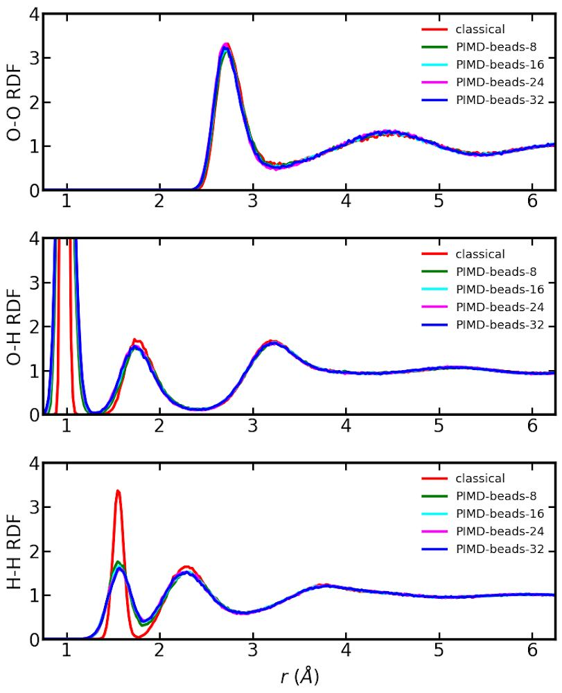

# 《分子动力学模拟入门》第六章：分子动力学模拟的高级课题

本章介绍分子动力学模拟中的几个高级课题，包括蒙特卡洛-分子动力学混合模拟（一种以分子动力学模拟为主线，以蒙特卡洛模拟为辅助的模拟）、路径积分分子动力学、自由能计算等。

# Table of contents
- [蒙特卡洛与分子动力学混合模拟](#蒙特卡洛与分子动力学混合模拟)
  - [正则系综](#正则系综)
  - [半巨正则系综](#半巨正则系综)
  - [方差约束的半巨正则系综](#方差约束的半巨正则系综)
- [路径积分分子动力学基础](#路径积分分子动力学基础)
  - [量子力学基础](#量子力学基础)
  - [量子-经典对应](#量子-经典对应)
  - [路径积分分子动力学的概念](#路径积分分子动力学的概念)
  - [RPMD的概念](#RPMD的概念)
  - [CMD的概念](#CPMD的概念)
  - [路径积分分子动力学的算法](#路径积分分子动力学的算法)
  - [基本物理量的计算](#基本物理量的计算)
    - [势能的计算](#势能的计算)
    - [动能的计算](#动能的计算)
    - [位力的计算](#位力的计算)
    - [热流的计算](#热流的计算)
  - [路径积分分子动力学的应用](#路径积分分子动力学的应用)
    - [晶体的热熔](#晶体的热熔)
    - [晶体的热膨胀](#晶体的热膨胀)
    - [水的结构性质](#水的结构性质)
- [自由能计算](#自由能计算)
  - [自由能微扰理论](#自由能微扰理论)
  - [热力学积分方法](#热力学积分方法)
  - [基于非平衡模拟的热力学积分方法](#基于非平衡模拟的热力学积分方法)
    - [固态体系](#固态体系)
    - [液态体系](#液态体系)
    - [温度扫描](#温度扫描)
- [紧束缚分子动力学](#紧束缚分子动力学)
  - [电子输运](#电子输运)

## 蒙特卡洛与分子动力学混合模拟

### 正则系综

Canonical ensemble

### 半巨正则系综

Semi-grand canonical ensemble

### 方差约束的半巨正则系综

Variance-constrained semi-grand canonical ensemble

待写。快速过渡到 Feynman 路径积分量子力学。

## 路径积分分子动力学基础

### 量子力学基础

### 量子-经典对应

讨论 Chandler 和 Wolynes 1981 年 的工作。

### 路径积分分子动力学的概念

讨论 Parrinello 和 Rahman 1984 年的工作。

### RPMD 的概念

[Craig 和 Manolopoulos](https://doi.org/10.1063/1.1777575) 于2004 提出了 ring-polymer MD （RPMD).

### CMD 的概念

[Jianshu Cao 和 Gregory A. Voth](https://doi.org/10.1063/1.467175) 于 1994 提出 centroid MD (CMD).

（但本书可能不打算针对 CMD 编程）

### 路径积分分子动力学的算法

首先讲 Ceriotti 等人针对PIMD的 PILE (path integral Langevin equation)。

[Efficient stochastic thermostatting of path integral molecular dynamics](https://doi.org/10.1063/1.3489925)

然后讲RPMD 以及 TRPMD (thermostatted RPMD) 的实现。

RPMD: [Quantum statistics and classical mechanics: Real time correlation functions from ring polymer molecular dynamics](https://doi.org/10.1063/1.1777575)

Lecture notes:
https://www.tugraz.at/fileadmin/user_upload/Institute/PTC/WTC/WTC_2019/2_Manolopoulos_19.L2.pdf

TRPMD: [How to remove the spurious resonances from ring polymer molecular dynamics](https://doi.org/10.1063/1.4883861)

这里要重点介绍 Korol 等人的 Cayley 变换。[Cayley modification for strongly stable path-integral and ring-polymer molecular dynamics](https://doi.org/10.1063/1.5120282)

用简谐振子为例编程实现。MATLAB 即可。

### 基本物理量的计算

势能的计算
动能的计算

位力的计算
热流的计算

### 路径积分分子动力学的应用

晶体的热熔

简写振子的能量。

晶体的热膨胀

水的结构性质

用公开的 [NEP 势](https://gitlab.com/brucefan1983/nep-data) 计算水的径向分布函数，结果如下图所示。

## 自由能微扰理论

## 热力学积分方法

## 基于非平衡模拟的热力学积分方法

### 固态体系

### 液态体系

### 温度扫描
