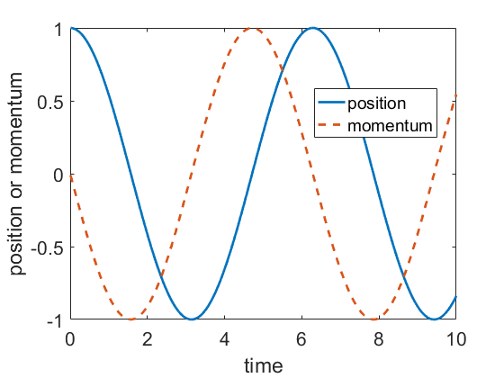

# 《分子动力学模拟入门》第一章：经典力学基础

在学习分子动力学模拟之前，需要熟悉经典力学、热力学和统计物理。本章将简要地回顾经典力学的知识并通过简谐振子开始编写一个最简单的类似于分子动力学模拟的小程序。

# Table of contents
- [牛顿力学](#牛顿力学)
 	- [质点力学](#质点力学)
 	- [粒子系力学](#粒子系力学)
 	- [运动方程的数值积分](#粒子系力学)
 	  - [Verlet积分算法](#Verlet积分算法)
 	  - [速度-Verlet积分算法](#速度-Verlet积分算法)
 	- [简谐振子运动的数值求解](#简谐振子运动的数值求解)
- [分析力学](#分析力学)
  - [拉格朗日方程](#拉格朗日方程)
  - [哈密顿方程](#哈密顿方程)
  - [相空间](#相空间)
  - [泊松括号和刘维尔算符](#泊松括号和刘维尔算符)
  - [经典的时间演化算符](#经典的时间演化算符)

## 牛顿力学

### 质点力学

理论上，牛顿力学里面最基本的研究对象是质点，它是指一个有特定的质量 但其大小对所研究的问题不重要的物体。有人也称它为一个粒子。这也将是分子动力学模拟中最重要的研究对象之一。 一个粒子在三维空间的运动由一个位置函数 $\vec{r}(t)$ 完全描述。也就是说，在一个时刻 $t$ ，粒子的位置由一个有三个分量的矢量 

$$
\vec{r}(t)=x(t)\vec{e}_x + y(t) \vec{e}_y + z(t) \vec{e}_z
$$ 

给出。当然，如果不指定一个参考系，我们将无法确定这三个分量的值。参考系的数学本质是坐标系。我们说粒子的位置函数完全地描述了粒子的运动性质，是因为其它的运动性质，比如速度和加速度，都可以由位置函数导出。

速度函数定义为位置函数对时间的一阶导数：

$$
\vec{v}(t) = \frac{d \vec{r}(t)}{d t} = \dot{\vec{x}}(t)
=\frac{dx}{dt} \vec{e}_x + \frac{dy}{dt} \vec{e}_y + \frac{dz}{dt} \vec{e}_z.
$$

加速度函数定义为位置函数对时间的二阶导数，或者速度函数对时间的一阶导数：

$$
\vec{a}(t) = \frac{d ^2\vec{r}(t)}{d t^2} = \frac{d \vec{v}(t)}{d t}
= \ddot{\vec{r}}(t) = \dot{\vec{v}}(t).
$$

以上对粒子运动的描述就是所谓的运动学。下面我们讨论质点的动力学。

动力学研究物体运动及其改变的原因。牛顿运动定律让我们可以在一定的条件下确定一个粒子的位置函数 $\vec{r}(t)$。

牛顿第一定律。一个粒子在施加于它的合外力 $\vec{F}$ 为零时保持静止或者一个恒定的速度 $\vec{v}$ :

$$
\vec{F} = \vec{0} \Rightarrow  \vec{v} = \text{const}.
$$

该定律也叫惯性定律，或者惰性定律，意思是在合外力为零的情况下，一个粒子懒得改变它原来的运动状态：原来静止的话就继续静止；原来运动的话就继续原来的运动。

牛顿第二定律。一个粒子的动量 $\vec{p}$ 的时间变化率 $d\vec{p}/dt$ 正比于作用于它的合外力 $\vec{F}$：

$$
\vec{F} = \frac{d \vec{p}}{d t}.
$$

一个粒子的动量定义为其惯性质量 $m$ 与速度 $\vec{v}$ 的乘积：

$$
\vec{p}=m\vec{v}
$$

如果粒子的惯性质量是个常数的话，那么上式就变成

$$
\vec{F} = m\frac{d \vec{v}}{d t} = m \vec{a}.
$$

我们强调了这里的 $m$ 是惯性质量，原因是牛顿力学里面还有另外一个质量，叫做引力质量，虽然它们是等价的。

牛顿第三定律。每一个作用力都有一个与之大小相等、方向相反的反作用力。例如，如果有一个由粒子 2 作用在粒子 1 上的作用力  $\vec{F}_{12}$ ，那么一定同时存在一个由粒子 1 作用在粒子 2 上的反作用力  $\vec{F}_{21}$ ，它们大小相等，方向相反：

$$
\vec{F}_{12} = -\vec{F}_{21}.
$$

当然，作用力和反作用力是相对的；把一对作用力中的哪一个叫做作用力，哪一个叫做反作用力是随意的。上式表达的是牛顿第三定律的弱形式。还有一个强形式的牛顿第三定律：

$$
\vec{F}_{12} \propto \vec{r}_{12} \equiv \vec{r}_{2} - \vec{r}_{1}
$$

显然，满足了牛顿第三定律的强形式，就一定满足了牛顿第三定律的弱形式，但反之不然。

我们在陈述牛顿第二定律时已经定义了动量。根据牛顿第二定律，如果作用在一个粒子上的合力为零，那么该粒子的动量将保持为一个常数：

$$
\vec{F} = \vec{0} \Rightarrow \vec{p} = \text{常数}.
$$

这就叫做动量守恒定律。

一个粒子的角动量被定义为：

$$
\vec{L} = \vec{x} \times \vec{p}.
$$

因为位置 $\vec{x}$ 依赖于坐标系原点的选取，角动量也依赖于坐标原点的选择。类似地，我们定义作用在粒子上的力矩 $\vec{\tau}$ 为：

$$
\vec{\tau} = \vec{x} \times \vec{F}.
$$

其中，$\vec{F}$ 是作用在粒子上的力。让我们来考察角动量的时间变化率：

$$
\frac{d \vec{L}}{dt} = \frac{d (\vec{x} \times \vec{p})}{dt}
= \vec{v} \times \vec{p} + \vec{x} \times \vec{F}
= \vec{x} \times \vec{F} = \vec{\tau}.
$$

这就是说，角动量的变化率等于力矩。显然，如果作用在粒子上的力矩为零，则粒子的角动量是常数：

$$
\vec{\tau} = \vec{0} \Rightarrow \vec{L} = \text{常数}.
$$

这叫做角动量守恒定律。

除了动量，还可以定义一个仅仅与质量和速度有关的物理量，叫做动能：

$$
T = \frac{1}{2}m \vec{v}^2 =
\frac{1}{2}m \vec{v} \cdot \vec{v}
= \frac{1}{2}m (v_x^2 + v_y^2 + v_z^2).
$$

在一个力 $\vec{F}$ 的作用下，如果粒子运动了一个微分位移

$$
d\vec{x} = dx \vec{e}_1 + dy \vec{e}_2 + dz \vec{e}_3
$$

那么我们定义该力对该粒子做的微功为：

$$
d W = \vec{F} \cdot d\vec{x} = F_x dx + F_y dy + F_z dz.
$$

进一步推导可得

$$
d W
= \vec{F} \cdot \vec{v} dt
= (\vec{F} dt) \cdot \vec{v}
= d\vec{p} \cdot \vec{v}
= m d\vec{v} \cdot \vec{v}
= d \left( \frac{1}{2}  m \vec{v}^2 \right)
= dT.
$$

所以，在一个过程中，外力对一个粒子做的功等于粒子动能的改变量。

在上面的讨论中，我们假定了一条连接起点和终点的具体的轨迹（即路径）。外力 $\vec{F}$ 作的功一般来说依赖于路径的选取。然而，如果外力做的功与具体的路径无关，而只与起点和终点有关，那么由矢量分析的定理可知，该外力可以写成一个标量场 $U(\vec{x})$ 的梯度的负值（这个负号是一种约定）：

$$
\vec{F} = -\nabla U(\vec{x}).
$$

该标量场 $U(\vec{x})$ 叫做粒子的势能场，简称为势能，或者进一步简称为势。与此对应的力称为保守力。该保守力沿任意微小路径对粒子做的总功为：

$$
dW = - \nabla U(\vec{x}) \cdot d\vec{x} = - dU.
$$

将该式与前面得到的 $dW = dT$ 比较可得：

$$
dT + dU = 0.
$$

这就是说，在一个保守力的作用下，任意过程中粒子的动能与势能的和都不改变。这个不改变的量称为机械能。所以，在保守力的作用下，粒子的机械能是守恒的。

### 粒子系力学

在具体讨论粒子系的动力学行为之前必须先弄清楚内力和外力的区别。内力是系统中某个粒子作用于另一个粒子的，而外力来自于系统之外。内力满足牛顿第三定律。虽然外界施与粒子 $i$ 一个力 $\vec{F}^{\text{ext}}_{i}$ 的同时，粒子 $i$ 同时也施与外界一个大小相等、方向相反的反作用力，但由于我们的系统不包含外界，我们通常不会对外力利用第三定律。以上就是内力与外力的区别。

对任意一个粒子 $i$，我们可以写下它的动力学方程：

$$
m_i \ddot{\vec{x}}_i = \sum_{j\neq i} \vec{F}_{ij} + \vec{F}^{\text{ext}}_{i}.
$$

将上式左右两边都对指标 $i$ 求和，得

$$
\sum_i m_i \ddot{\vec{x}}_i = \sum_i \sum_{j\neq i} \vec{F}_{ij} + \sum_i \vec{F}^{\text{ext}}_{i}.
$$

根据牛顿第三定律，等号右边的第一项等于零。系统的总质量定义为 $m = \sum_i m_i$。如果定义一个平均坐标

$$
\vec{x} = \frac{\sum_i m_i \vec{x}_i}{m},
$$

那么我们有

$$
m \ddot{\vec{x}} = \sum_i \vec{F}^{\text{ext}}_{i}.
$$

这个式子看上去很像一个质量为系统总质量 $m$，坐标为平均坐标 $\vec{x}$ 的粒子的动力学方程；该粒子所受的合外力为整个粒子系所受的合外力。我们称这个等效的粒子为粒子系的质心。质心的质量就是整个系统的质量；质心坐标就是上述平均坐标；质心的运动满足上述等效的牛顿第二定律。

由质心坐标可以定义质心速度

$$
\dot{\vec{x}} = \frac{\sum_i m_i \dot{\vec{x}}_i}{m}
$$
和质心动量

$$
\vec{p} = m \dot{\vec{x}} = \sum_i m_i \dot{\vec{x}}_i.
$$

于是，质心的牛顿第二定律可用质心动量表达为：

$$
\frac{d \vec{p}}{dt} = \sum_i \vec{F}^{\text{ext}}_{i}.
$$

如果系统受到的合外力为零，那么系统的质心动量（即系统的总动量）是守恒的。这就是质点系的动量守恒定律。

类似地，由牛顿第三定律可以证明内力对系统的总力矩的贡献也是零，即系统所受的总力矩等于外力的总力矩 $\vec{\tau}^{\text{ext}}$：

$$
\vec{\tau}^{\text{ext}} = \sum_i^N \vec{x}_i \times \vec{F}_i^{\text{ext}}.
$$

如果定义系统的总角动量为

$$
\vec{L} = \sum_i^N \vec{L}_i = \sum_i^N \vec{x}_i \times \vec{p}_i,
$$

那么可以证明如下的角动量定理：

$$
\frac{d \vec{L}}{dt} = \vec{\tau}^{\text{ext}}.
$$

这就是说，外力产生的总力矩等于系统总角动量的时间变化率。如果外力产生的总力矩等于零，则有系统的总角动量守恒。这就是质点系的角动量守恒定理。

不同于力和力矩，内力对系统中的粒子做的总功并不一定为零。例如，两个粒子在相互的排斥力的作用下从静止开始做反向的加速运动，它们之间的内力做了正功。在一个微小过程中，如果第 $i$ 个粒子的微分位移为 $d\vec{x}_i$ ，那么内力对系统中的粒子做的功为

$$
dW^{\text{int}} = \sum_i^N \vec{F}_i^{\text{int}} \cdot d\vec{x}_i,
$$

外力对系统中的粒子做的功为
$$
dW^{\text{ext}} = \sum_i^N \vec{F}_i^{\text{ext}} \cdot d\vec{x}_i.
$$

系统中的粒子得到的总功为

$$
dW = dW^{\text{ext}} + dW^{\text{int}}.
$$

因为对每一个粒子，有

$$
(\vec{F}_i^{\text{int}} + \vec{F}_i^{\text{ext}}) \cdot d\vec{x}_i = d T_i,
$$

所以，综合起来有

$$
dW=dT.
$$

其中， $T$ 定义为系统的总动能：

$$
T = \sum_i^N T_i = \sum_i^N  \left( \frac{1}{2} m_i \vec{v}_i^2 \right).
$$

这就是说，内力和外力做的功的总和等于系统总动能的改变。只有内力和外力做的总功为零时，系统的动能才守恒。

对于有相互作用的多粒子系统，如果内力和外力都是保守力，那么系统的总势能可以表达为

$$
U = \sum_i U_i + \frac{1}{2} \sum_i^N \sum_{j\neq i}^N U_{ij},
$$

其中， $U_i$ 是第 $i$ 个粒子在外力场中的势能， $U_{ij}$ 是系统中由 $i$ 与 $j$ 的相互作用导致的势能。


### 运动方程的数值积分

#### Verlet积分算法

#### 速度Verlet积分算法

### 简谐振子运动的数值求解

我们用一个简谐振子模型来展示速度-Verlet算法的实现，Matlab 代码如下：
```matlab
m=1; lambda=1; dt=0.01; n_step=1000;
p=0; q=1; 
pp=zeros(n_step,1); qq=zeros(n_step,1);
for step=1:n_step
    p=p-(dt/2)*m*lambda*lambda*q; 
    q=q+(dt/m)*p;
    p=p-(dt/2)*m*lambda*lambda*q;
    pp(step,:)=p; qq(step,:)=q;
end
```

下面是坐标和动量随时间变化的图：




## 分析力学

### 拉格朗日方程

我们知道，一个由 $N$ 个质点构成的力学系统需要用 $3N$ 个坐标分量及其相应的速度分量来描述其运动状态。我们说，该系统的力学自由度为 $3N$。 但如果是一个由这 $N$ 个质点构成的刚体，则自由度只有 6：3 个平动自由度和 3 个转动自由度。刚体的自由度之所以小于自由质点系统的自由度，是因为刚体系统中有约束。

约束的分类很复杂，但我们只关注最简单的一种：稳定的几何约束。考虑一个由 $N$ 个质点构成的力学系统，其中第 $i$ 个质点的位置为 $\vec{x}_i$ 。一个稳定的几何约束一般可以表达为：

$$
f(\vec{x}_1, \vec{x}_2,\cdots) = 0.
$$

其中， $f$ 是个一般的函数。

容易看出，一个原本有 $M$ 个自由度的体系，若受到 $m$ 个几何约束，则其自由度为 $s=M-m$。要描述该体系，我们不一定需要使用原来的 $M$ 个坐标和速度，而可以构造 $s$ 个新的坐标和速度。这 $s$ 个新的坐标不一定限于在原来的 $M$ 个老坐标中挑选，而完全可以另行选取。这样选取的新坐标叫做广义坐标。广义坐标不一定能三个一组地构成矢量，而且某个广义坐标也不一定具有长度的量纲。相应地，某个广义速度也不一定具有速度的量纲。

将 $s$ 个广义坐标 $q_1, q_2, \cdots q_s$ 的集合简记为 $q$。对于保守力体系，可以从牛顿力学出发推导出如下拉格朗日方程：

$$
\frac{d}{dt}
\left(\frac{\partial (T-U)}{\partial \dot{q}_{\alpha}}\right)
-\frac{\partial (T-U)}{\partial q_{\alpha}} = 0.
\quad (\alpha = 1, 2, \cdots, s)
$$

这里出现的动能与势能的差是一个很重要的量，叫做拉格朗日量，记为

$$
L(q, \dot{q}) = T(\dot{q}) - U(q).
$$

用拉格朗日量可以将拉格朗日方程写成更加简洁的形式：

$$
\boxed{
\frac{d}{dt}
\left(\frac{\partial L}{\partial \dot{q}_{\alpha}}\right)
-\frac{\partial L}{\partial q_{\alpha}} = 0.
\quad (\alpha = 1, 2, \cdots, s)
}
$$

例子：简谐振子的拉格朗日量为

$$
L = \frac{1}{2} m \dot{x}^2 - \frac{1}{2} k \dot{x}^2
$$

由此可以推导出简谐振子的运动方程。


### 哈密顿 (Hamilton) 方程

由于拉格朗日量具有能量的量纲，故当广义坐标具有长度的量纲时，偏导数 $\frac{\partial L}{\partial \dot{q}_{\alpha}}$ 具有动量的量纲。我们称这个偏导数为广义动量，记为

$$
\boxed{p_{\alpha} = \frac{\partial L}{\partial \dot{q}_{\alpha}}}.
$$

注意，当广义坐标不具有长度的量纲时，相应的广义动量也不具有动量的量纲。运用广义动量可以将拉格朗日方程写成更加简洁的形式：

$$
\boxed{
\dot{p}_{\alpha}
-\frac{\partial L}{\partial q_{\alpha}} = 0.
\quad (\alpha = 1, 2, \cdots, s)
}
$$

虽然广义动量出现在拉格朗日方程中，但我们要清楚的是拉格朗日量是广义坐标和广义速度的函数，而不是广义动量的函数。用勒让德变换可以改变一个多元函数的独立变量。为此，我们先写下拉格朗日量的全微分：

$$
d L(q, \dot{q}) = \frac{\partial L}{\partial q_{\alpha}} d q_{\alpha} + \frac{\partial L}{\partial \dot{q}_{\alpha}} d \dot{q}_{\alpha} = \dot{p}_{\alpha} d q_{\alpha} + p_{\alpha} d \dot{q}_{\alpha}.
$$

下面的勒让德变换能将独立变量从广义速度变成广义动量：

$$
L \rightarrow p_{\alpha} \dot{q}_{\alpha} - L.
$$

该式箭头右边的表达式是一个很重要的量，记为

$$
H= p_{\alpha} \dot{q}_{\alpha} - L.
$$

该量称为哈密顿量。我们来看看它是不是真的是广义动量的函数了。为此，我们计算它的全微分：

$$
d H = p_{\alpha} d\dot{q}_{\alpha} + \dot{q}_{\alpha} d p_{\alpha} - (\dot{p}_{\alpha} d q_{\alpha} + p_{\alpha} d \dot{q}_{\alpha}) =\dot{q}_{\alpha} d p_{\alpha} - \dot{p}_{\alpha} d q_{\alpha}.
$$

看来哈密顿量确实是广义动量以及广义坐标的函数，而不是广义速度的函数了。

既然哈密顿量是广义动量和广义坐标的函数，那么根据全微分的定义，我们又有

$$
d H = \frac{\partial H}{\partial q_{\alpha}} d q_{\alpha} + \frac{\partial H}{\partial p_{\alpha}} d p_{\alpha}.
$$

对比以上两个式子，我们得到如下两组重要的方程：

$$
\boxed{\dot{q}_{\alpha} = \frac{\partial H}{\partial p_{\alpha}}, \quad (\alpha = 1 , 2, \cdots, s)}
$$

$$
\boxed{\dot{p}_{\alpha} = - \frac{\partial H}{\partial q_{\alpha}}. \quad (\alpha = 1 , 2, \cdots, s)}
$$

这 $2s$ 个一阶微分方程组称为哈密顿正则方程。这里的“正则”意为“简单且对称”。

例子：简谐振子的哈密顿量。

### 相空间

广义坐标和广义动量是相互独立的变量。我们可以将$s$个广义坐标 $\{q_{\alpha}\}_{\alpha=1}^{s}$ 和 $s$ 个广义动量 $\{p_{\alpha}\}_{\alpha=1}^{s}$ 看成一个 $2s$ 维“空间”的“坐标”。这个抽象的“空间”叫做相空间。一组给定的广义坐标和广义动量叫做相空间的一个相点。另外，根据哈密顿正则方程，只要给定一个初始条件，即初始时刻的各个广义坐标和广义动量，就可以唯一地确定任意时刻的各个广义坐标和广义动量，即如下 $2s$ 个函数：

$$
q_{\alpha} = q_{\alpha}(t), \quad p_{\alpha} = p_{\alpha}(t). \quad (\alpha = 1, 2, \cdots, s)
$$

这 $2s$ 个函数将在 $2s$ 维的相空间给出一条轨迹，叫做相轨迹。随着时间的推移，一条相轨迹会在相空间跑动，历经很多不同的相点。一个系统中不同的初始条件会给出不同的相轨迹，而两条不同的相轨迹绝对不会相交于某一个相点（请读者自行证明）。

例子：简谐振子的相空间。


### 泊松括号和刘维尔算符

一个一般的物理量可以表达为相空间坐标的函数

$$
A=A(q_{\alpha}, p_{\alpha})
$$

我们求它的时间导数

$$
\frac{dA}{dt}=\frac{\partial A}{\partial q_{\alpha} } \dot{q}_{\alpha} 
+\frac{\partial A}{\partial p_{\alpha} } \dot{p}_{\alpha}
$$

利用哈密顿正则方程，可得

$$
\frac{dA}{dt}=\frac{\partial A}{\partial q_{\alpha} } 
\frac{\partial H}{\partial p_{\alpha} }
-\frac{\partial A}{\partial p_{\alpha} } 
\frac{\partial H}{\partial q_{\alpha} }
$$

定义任意两个物理量之间的泊松括号

$$
\{A,B\}=\frac{\partial A}{\partial q_{\alpha} } 
\frac{\partial B}{\partial p_{\alpha} }
-\frac{\partial A}{\partial p_{\alpha} } 
\frac{\partial B}{\partial q_{\alpha} }
$$

我们有

$$
\frac{dA}{dt}=\{A,H\}
$$

一个物理量A和哈密顿量之间的泊松括号运算也常用刘维尔算符表示

$$
\frac{dA}{dt}=\{A,H\}\equiv iLA
$$

该方程的形式解为

$$
A(t)=e^{iL}A(t=0)
$$

可以证明，刘维尔算符是厄米算符，故上述指数算符是幺正算符。我们以后会大量使用刘维尔算符进行推导。

### 刘维尔定理

就像可以定义质量密度和电荷密度一样，也可以定义相空间的相点密度。首先定义相空间的体积元

$$
d \Gamma = dq_1  dq_2 \cdots dq_s dp_1  dp_2 \cdots dp_s = dq dp
$$

体积元并不是数学上严格的微分，其大小的选取满足“宏观小”和“微观大”的要求。上式中第二个等号右边是常用的简写形式。如果在该体积元中相点的个数为$dN$，那么就可以定义该体积元所在之处的相点密度：

$$
\rho(q, p) = \frac{dN}{d \Gamma}
$$

上式中的相点 $(q, p)$ 可以是体积元 $d\Gamma$ 中的任意一点。如果将相空间类比于普通三维空间，将相点类比为三维空间中流体的质点，那么相点密度就对应于流体的质量密度。这个类比对下面的讨论是非常有用的。

下面我们来证明在统计物理中非常重要刘维尔定理：

$$
\frac{d \rho}{dt} = 0.
$$

这个定理是说：相点密度不随时间的变化而变化。首先，我们要清楚的是，虽然我们上面将相点密度写成了广义坐标和广义动量的函数，并不能说相点密度对时间的导数显然是零，因为广义坐标和广义动量可以是时间的函数。确切地讲，刘维尔定理说的是对任意的相轨迹， 相点密度是一个常量。

正如上面提到的，我们将相空间和其中的相点比作流体。对于这样的“流体”，我们有如下守恒定律：

$$
\frac{\partial \rho}{\partial t} + \frac{\partial}{\partial q_{\alpha}} (\rho \dot{q}_{\alpha}) + \frac{\partial}{\partial p_{\alpha}} (\rho \dot{p}_{\alpha}) = 0.
$$

类似的公式在电磁学中叫做电荷守恒定律。因为相点是不会凭空产生和消失的，那么这个“流体”还不是一般的流体，而是不可压缩流体。对于不可压缩流体，上式中的“散度”处处为零：

$$
\frac{\partial}{\partial q_{\alpha}} (\rho \dot{q}_{\alpha}) + \frac{\partial}{\partial p_{\alpha}} (\rho \dot{p}_{\alpha}) = 0.
$$

于是，我们有

$$
\frac{\partial \rho}{\partial t} = 0.
$$

这就是说，相点密度不显含时间。这也是我们将相点密度写成 $\rho(q, p)$ ，而不是 $\rho(q, p, t)$ 的原因。

要证明刘维尔定理，就是要证明下式：

$$
\frac{d \rho}{dt} = \frac{\partial \rho}{\partial q_{\alpha}} \dot{q}_{\alpha} + \frac{\partial \rho}{\partial p_{\alpha}} \dot{p}_{\alpha} = 0.
$$

将此式与上面“散度”为零的式子比较可知，只要能证明下式就大功告成了：

$$
\frac{\partial \dot{q}_{\alpha} }{\partial q_{\alpha}} + \frac{\partial \dot{p}_{\alpha} }{\partial p_{\alpha}} = 0.
$$

根据哈密顿正则方程，该式显然是恒成立的。刘维尔定理证毕。
